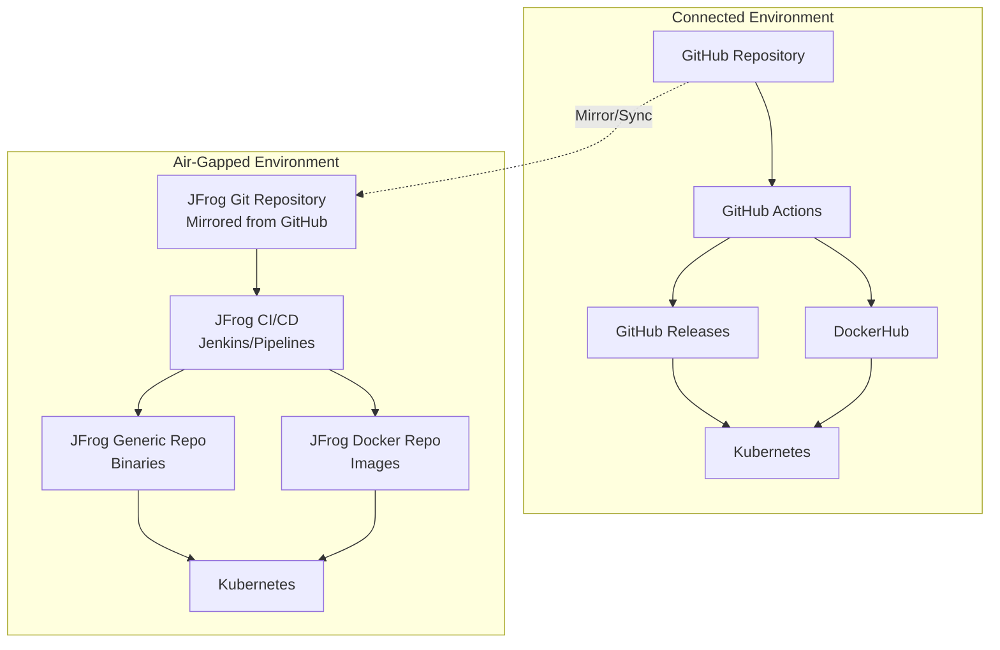
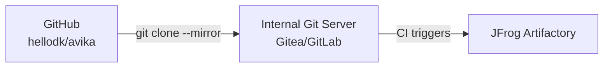
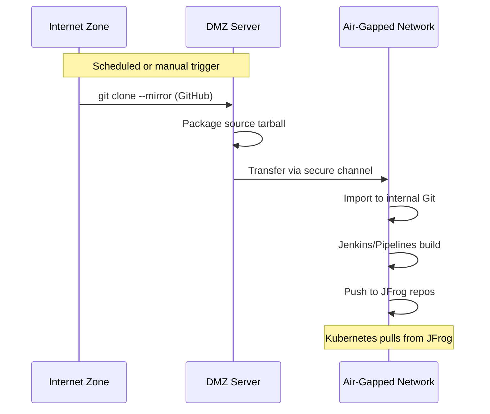
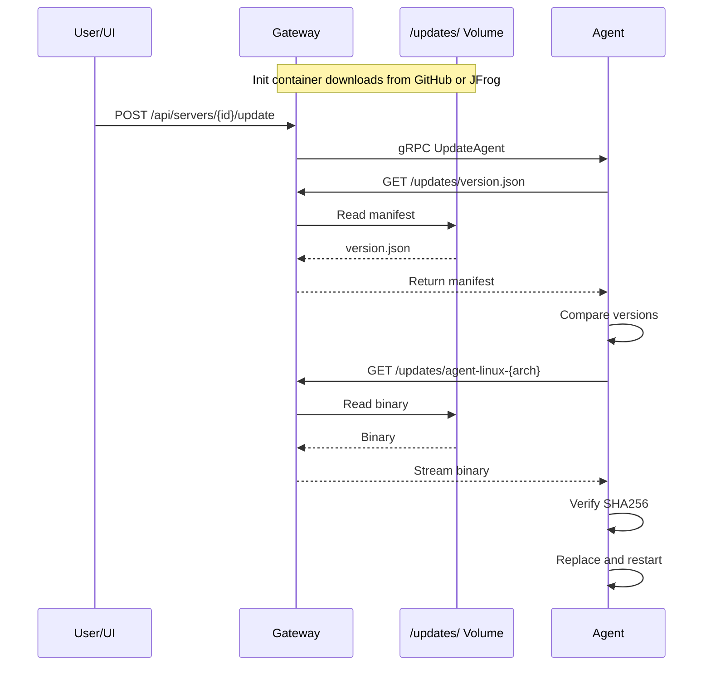

# Agent Distribution Architecture

## Two Deployment Models




---

## Option A: Connected Environment (With Internet)

Direct use of GitHub and DockerHub - the current setup.

### How It Works

1. **Source Code**: GitHub (`hellodk/avika`)
2. **CI/CD**: GitHub Actions builds on push to master
3. **Binaries**: Published to GitHub Releases
4. **Images**: Pushed to DockerHub (`hellodk/avika-`*)
5. **Deployment**: Kubernetes pulls from DockerHub, Gateway fetches binaries from GitHub

### Gateway Binary Distribution

```yaml
# values.yaml for connected environment
gateway:
  updates:
    source: github
    githubRepo: hellodk/avika
```

Gateway init container downloads from:

- `https://github.com/hellodk/avika/releases/latest/download/agent-linux-amd64`
- `https://github.com/hellodk/avika/releases/latest/download/agent-linux-arm64`

---

## Option B: Air-Gapped Environment (JFrog Only)

Mirror GitHub repository to JFrog and build everything internally.

### Step 1: Mirror GitHub Repository to JFrog

JFrog Artifactory supports **Git LFS** repositories. For source code mirroring, use one of:

**Option B1: JFrog + External Git Mirror**




Set up a scheduled sync job (cron or GitLab CI):

```bash
#!/bin/bash
# sync-github-mirror.sh - Run on DMZ server with internet access

GITHUB_REPO="https://github.com/hellodk/avika.git"
INTERNAL_REPO="git@internal-gitlab.company.com:avika/avika.git"

# Clone/update mirror
if [ -d "/mirrors/avika.git" ]; then
    cd /mirrors/avika.git && git fetch --all --tags
else
    git clone --mirror $GITHUB_REPO /mirrors/avika.git
fi

# Push to internal
cd /mirrors/avika.git
git push --mirror $INTERNAL_REPO
```

**Option B2: Manual Tarball Sync (Fully Air-Gapped)**

For completely disconnected networks:

```bash
# On internet-connected machine
git clone --depth 1 https://github.com/hellodk/avika.git
tar -czf avika-v0.1.94.tar.gz avika/

# Transfer via secure media to air-gapped network

# On air-gapped machine
tar -xzf avika-v0.1.94.tar.gz
cd avika && git init && git add . && git commit -m "Import v0.1.94"
git remote add origin git@internal-gitlab.company.com:avika/avika.git
git push -u origin master --tags
```

### Step 2: Build Internally with JFrog Pipelines or Jenkins

**JFrog Pipelines Configuration** (`pipelines.yml`):

```yaml
resources:
  - name: avikaGitRepo
    type: GitRepo
    configuration:
      gitProvider: internal_gitlab
      path: avika/avika
      branches:
        include: master

  - name: avikaDockerImage
    type: Image
    configuration:
      registry: artifactory
      sourceRepository: avika-docker-local
      imageName: avika-gateway
      imageTag: ${run_number}

pipelines:
  - name: avika_build
    steps:
      - name: build_binaries
        type: Bash
        configuration:
          inputResources:
            - name: avikaGitRepo
        execution:
          onExecute:
            - cd $res_avikaGitRepo_resourcePath
            - VERSION=$(cat VERSION)
            - make build-all
            - jfrog rt upload "nginx-agent/agent-*" "avika-generic/${VERSION}/"
      
      - name: build_images
        type: DockerBuild
        configuration:
          dockerFileLocation: cmd/gateway
          dockerFileName: Dockerfile
          inputResources:
            - name: avikaGitRepo
          integrations:
            - name: artifactory
        execution:
          onExecute:
            - VERSION=$(cat $res_avikaGitRepo_resourcePath/VERSION)
            - docker build --build-arg VERSION=$VERSION -t $int_artifactory_url/avika-docker/avika-gateway:$VERSION .
            - docker push $int_artifactory_url/avika-docker/avika-gateway:$VERSION
```

**Jenkins Pipeline Alternative** (`Jenkinsfile`):

```groovy
pipeline {
    agent any
    
    environment {
        JFROG_URL = 'https://artifactory.company.com'
        VERSION = readFile('VERSION').trim()
    }
    
    stages {
        stage('Build Binaries') {
            steps {
                sh 'make build-all'
                rtUpload (
                    serverId: 'jfrog-artifactory',
                    spec: '''{
                        "files": [{
                            "pattern": "nginx-agent/agent-*",
                            "target": "avika-generic/${VERSION}/"
                        }]
                    }'''
                )
            }
        }
        
        stage('Build Images') {
            steps {
                script {
                    def images = ['gateway', 'frontend', 'agent']
                    images.each { img ->
                        docker.build("${JFROG_URL}/avika-docker/avika-${img}:${VERSION}", 
                                     "--build-arg VERSION=${VERSION} -f cmd/${img}/Dockerfile .")
                        docker.push("${JFROG_URL}/avika-docker/avika-${img}:${VERSION}")
                    }
                }
            }
        }
        
        stage('Generate Manifest') {
            steps {
                sh '''
                    cat > version.json << EOF
                    {
                        "version": "${VERSION}",
                        "release_date": "$(date -Iseconds)",
                        "binaries": {
                            "linux-amd64": {
                                "url": "${JFROG_URL}/artifactory/avika-generic/${VERSION}/agent-linux-amd64",
                                "sha256": "$(sha256sum nginx-agent/agent-linux-amd64 | cut -d' ' -f1)"
                            },
                            "linux-arm64": {
                                "url": "${JFROG_URL}/artifactory/avika-generic/${VERSION}/agent-linux-arm64",
                                "sha256": "$(sha256sum nginx-agent/agent-linux-arm64 | cut -d' ' -f1)"
                            }
                        }
                    }
                    EOF
                '''
                rtUpload (
                    serverId: 'jfrog-artifactory',
                    spec: '''{
                        "files": [{
                            "pattern": "version.json",
                            "target": "avika-generic/${VERSION}/"
                        }]
                    }'''
                )
            }
        }
    }
}
```

### Step 3: JFrog Repository Structure

```
artifactory/
├── avika-git-lfs/           # Git LFS for large files (optional)
├── avika-generic/           # Generic repository for binaries
│   ├── 0.1.94/
│   │   ├── version.json
│   │   ├── agent-linux-amd64
│   │   ├── agent-linux-arm64
│   │   └── checksums.txt
│   └── latest -> 0.1.94/    # Virtual symlink
├── avika-docker/            # Docker repository
│   ├── avika-gateway/
│   │   ├── 0.1.94/
│   │   └── latest/
│   ├── avika-frontend/
│   └── avika-agent/
└── avika-helm/              # Helm repository
    └── avika-0.1.94.tgz
```

### Step 4: Kubernetes Deployment from JFrog

**Helm values for air-gapped deployment:**

```yaml
global:
  imageRegistry: artifactory.company.com/avika-docker
  imagePullSecrets:
    - name: jfrog-registry-secret

gateway:
  image:
    repository: artifactory.company.com/avika-docker/avika-gateway
    tag: "0.1.94"
  updates:
    source: jfrog
    jfrogUrl: https://artifactory.company.com
    jfrogRepo: avika-generic

frontend:
  image:
    repository: artifactory.company.com/avika-docker/avika-frontend
    tag: "0.1.94"

agent:
  image:
    repository: artifactory.company.com/avika-docker/avika-agent
    tag: "0.1.94"
```

---

## Comparison: Connected vs Air-Gapped


| Aspect            | Connected (GitHub) | Air-Gapped (JFrog)        |
| ----------------- | ------------------ | ------------------------- |
| Source Code       | GitHub             | Internal Git (mirrored)   |
| CI/CD             | GitHub Actions     | Jenkins / JFrog Pipelines |
| Binaries          | GitHub Releases    | JFrog Generic Repo        |
| Images            | DockerHub          | JFrog Docker Repo         |
| Helm Charts       | GitHub Releases    | JFrog Helm Repo           |
| Sync Frequency    | Real-time          | Manual or scheduled       |
| Internet Required | Yes                | No (after initial sync)   |


---

## Sync Strategy for Air-Gapped




**Sync Options:**

1. **Automated (DMZ)**: Server in DMZ with internet access pulls from GitHub, pushes to internal Git
2. **Semi-automated**: Cron job creates tarballs, manual transfer to air-gapped network
3. **Fully manual**: Download release tarball, physically transfer media, import

---

## Gateway Init Container Configuration

The same init container works for both environments:

```bash
#!/bin/bash
# download-updates.sh

UPDATES_DIR="${UPDATES_DIR:-/updates}"
SOURCE="${ARTIFACT_SOURCE:-github}"
VERSION="${AGENT_VERSION:-latest}"

mkdir -p "$UPDATES_DIR"

if [ "$SOURCE" = "jfrog" ]; then
    BASE_URL="${JFROG_URL}/artifactory/${JFROG_REPO}/${VERSION}"
    # JFrog may require auth
    AUTH_HEADER="Authorization: Bearer ${JFROG_TOKEN}"
else
    if [ "$VERSION" = "latest" ]; then
        BASE_URL="https://github.com/hellodk/avika/releases/latest/download"
    else
        BASE_URL="https://github.com/hellodk/avika/releases/download/v${VERSION}"
    fi
    AUTH_HEADER=""
fi

# Download manifest and binaries
curl -fsSL ${AUTH_HEADER:+-H "$AUTH_HEADER"} "$BASE_URL/version.json" -o "$UPDATES_DIR/version.json"
curl -fsSL ${AUTH_HEADER:+-H "$AUTH_HEADER"} "$BASE_URL/agent-linux-amd64" -o "$UPDATES_DIR/agent-linux-amd64"
curl -fsSL ${AUTH_HEADER:+-H "$AUTH_HEADER"} "$BASE_URL/agent-linux-arm64" -o "$UPDATES_DIR/agent-linux-arm64"

chmod +x "$UPDATES_DIR"/agent-*
echo "Updates downloaded to $UPDATES_DIR"
```

---

## Data Flow: Agent Update (Both Environments)




