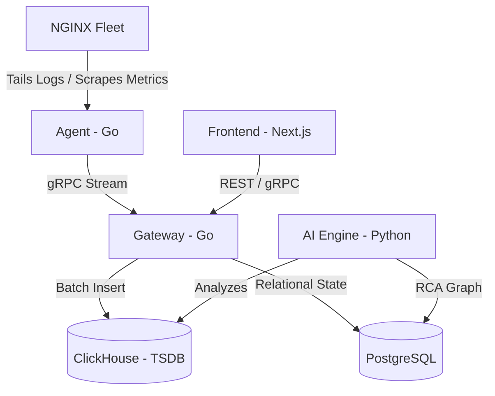

# System Architecture - NGINX Manager

This document provides a detailed overview of the NGINX Manager architecture, with a focus on data flow and state management.

## High-Level Overview

NGINX Manager is built as a distributed system designed for scalability and real-time observability. It follows a multi-tier architecture consisting of several specialized components.

## Core Components

### 1. Agent (Go)
The **Agent** is a lightweight binary that runs on the same host or container as the NGINX instance.
- **Metric Collection**: Scrapes `stub_status` for NGINX metrics and `/proc` for system metrics (CPU, Memory, Network) every 5 seconds.
- **Log Tailing**: Uses a high-performance tailer to read access and error logs.
- **Config Management**: Provisions and manages NGINX configuration files and SSL certificates.
- **Communication**: Maintains a persistent bidirectional gRPC stream to the Gateway.
- **Autonomous Lifecycle**: Supports automated self-updates with SHA256 verification and atomic binary swapping.

### 2. Gateway (Go)
The **Gateway** is the central orchestrator and data integrator.
- **Session Management**: Tracks active agents and their health.
- **Data Ingestion**: Processes incoming telemetry from multiple agents.
- **API Provider**: Serves the REST/gRPC API used by the frontend.
- **State Storage**: Uses PostgreSQL for configuration, user data, and relationship mapping.

### 3. ClickHouse (TSDB Equivalent) 🚀
We use **ClickHouse** as our primary Time-Series Database (TSDB). While ClickHouse is technically an OLAP engine, it serves as the backbone for all monitoring data in our application.

#### Why ClickHouse as a TSDB?
Compared to traditional TSDBs like Prometheus or InfluxDB, ClickHouse offers:
- **Massive Ingestion**: Capable of handling millions of events per second.
- **High Cardinality**: Handles large numbers of unique labels (IPs, URIs) without performance degradation.
- **Storage Efficiency**: Columnar storage and advanced compression reduce the storage footprint for time-series data.
- **SQL Power**: Allows for complex analytical queries (e.g., P99 latencies) directly in SQL.

#### TSDB Schema Structure
| Table Name | Description | Key Data |
| :--- | :--- | :--- |
| `access_logs` | Performance & Traffic | Status codes, request time, bytes, IP, URI |
| `system_metrics` | Infrastructure Health | CPU usage, Memory used/total, Network RX/TX |
| `nginx_metrics` | Application Health | Active connections, accepted/handled requests |

### 4. AI Engine (Python/Bytewax)
The **AI Engine** performs asynchronous analysis of the data stored in the TSDB.
- **Anomaly Detection**: Identifies deviations in request rates or error counts.
- **Root Cause Analysis (RCA)**: Correlates metrics and logs to build a dependency graph of issues.

### 5. Frontend (Next.js)
A modern React-based UI that provides:
- **Inventory Management**: View and manage NGINX instances.
- **Monitoring Dashboards**: Visualizes data from the ClickHouse TSDB.
- **Log Viewer**: Real-time streaming of logs from agents via the Gateway.

## Data Lifecycle

1. **Collection**: Agent gathers telemetry (Metrics every 5s, Logs in real-time).
2. **Transportation**: Data is streamed via gRPC to the Gateway.
3. **Storage**: Gateway performs batch-inserts into ClickHouse for high performance.
4. **Analysis**: AI Engine queries ClickHouse to detect patterns.
5. **Visualization**: Frontend queries the Gateway, which executes optimized SQL against ClickHouse.

---

## Technical Stack Summary

- **Backend**: Go (Agent & Gateway)
- **Frontend**: Next.js, Tailwind CSS, Recharts
- **Database (Relational)**: PostgreSQL
- **TSDB / Analytics**: ClickHouse
- **Communication**: gRPC (Internal), REST (External)
- **Deployment**: Docker Compose / Kubernetes
