# ClickHouse Deep Analysis & Optimization Plan

**Date:** 2026-03-28
**Cluster:** Single-node, `clickhouse-server:23.8-alpine`
**Resources:** 2 CPU / 4Gi memory / 10Gi PVC (80.9% disk used on host)

---

## 1. Current State (Live Data)

### 1.1 Table Inventory

| Table | Engine | Rows | Compressed | Uncompressed | Ratio | Parts | TTL |
|-------|--------|------|-----------|--------------|-------|-------|-----|
| `access_logs` | MergeTree | 1.1M | 35 MiB | 155 MiB | 4.4x | 7 | 7 days |
| `system_metrics` | MergeTree | 73K | 1.6 MiB | 7.6 MiB | 4.6x | 6 | 30 days |
| `nginx_metrics` | MergeTree | 74K | 829 KiB | 4.4 MiB | 5.5x | 5 | 30 days |
| `gateway_metrics` | MergeTree | 1.5K | 27 KiB | 104 KiB | 3.9x | 1 | 30 days |
| `spans` | MergeTree | 0 | 0 | 0 | - | 0 | 7 days |
| `geo_requests_hourly` | SummingMergeTree | 0 | 0 | 0 | - | 0 | 90 days |

### 1.2 System Table Bloat

| System Table | Rows | Size | Impact |
|-------------|------|------|--------|
| `query_log` | 96K | 13.25 MiB | Slows startup part loading |
| `trace_log` | 195K | 5.31 MiB | Slows startup part loading |
| `asynchronous_metric_log` | 6.1M | 4.63 MiB | **Biggest part accumulator** |
| `part_log` | 61K | 4.60 MiB | Slows startup part loading |
| `metric_log` | 15K | 3.91 MiB | Slows startup part loading |
| **Total** | **6.5M** | **31.7 MiB** | **CrashLoopBackOff root cause** |

### 1.3 Column Size Breakdown (access_logs)

| Column | Compressed | Uncompressed | Ratio | Issue |
|--------|-----------|--------------|-------|-------|
| `request_id` | 14.6 MiB | 31.5 MiB | 2.2x | **41% of table** — UUID strings compress poorly |
| `request_time` | 4.2 MiB | 4.4 MiB | 1.0x | Float32, almost no compression |
| `body_bytes_sent` | 3.8 MiB | 8.7 MiB | 2.3x | UInt64, sparse data |
| `remote_addr` | 3.3 MiB | 14.6 MiB | 4.4x | IP strings, reasonable |
| `client_ip` | 3.3 MiB | 14.6 MiB | 4.4x | **Duplicate of remote_addr** |
| `request_uri` | 2.5 MiB | 12.3 MiB | 4.8x | Variable-length paths |
| `instance_id` | 137 KiB | 16.5 MiB | **123x** | Low cardinality, excellent compression |
| `city` | 77 KiB | 17.4 MiB | **231x** | Low cardinality, excellent compression |

### 1.4 Query Performance (Last 24h)

| Query Pattern | Executions | Avg ms | Avg Rows Read | Issue |
|---------------|-----------|--------|---------------|-------|
| Time-series traffic (requests/errors per hour) | 1,560 | 21ms | 49K | Full table scan |
| Status distribution | 1,560 | 9ms | 49K | Full table scan |
| Top endpoints (with P95 quantile) | 1,560 | 11ms | 49K | Full table scan + sort |
| Latency distribution (buckets) | 1,560 | 5ms | 49K | Full table scan |
| Latency percentiles (P50/P95/P99) | 1,560 | 7ms | 49K | Full table scan |
| Summary (count/errors/bytes/latency) | 1,560 | 5ms | 49K | Full table scan |
| Status code counts (200/404/503) | 1,560 | 4ms | 49K | Full table scan |
| System metrics time-series | 1,560 | 20ms | 16K | OK |
| Nginx metrics time-series | 1,560 | 11ms | 16K | OK |
| Gateway metrics time-series | 1,565 | 9ms | 1K | OK |

**Key finding:** 14 queries x 1,560 executions = **21,840 queries/day** scanning the full `access_logs` table. Each dashboard refresh fires ~14 queries, and the 10s auto-refresh interval means ~8,640 refreshes/day per open dashboard tab.

---

## 2. Architecture Diagrams

### 2.1 Current Data Flow

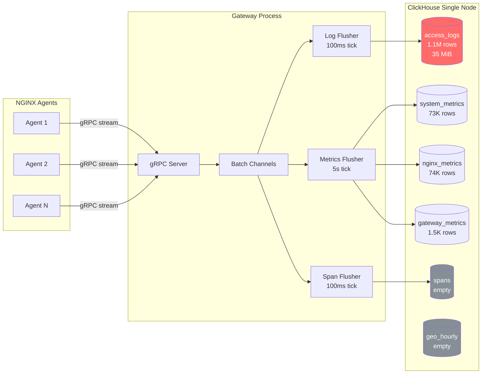

### 2.2 Current Query Pattern (Per Dashboard Refresh)

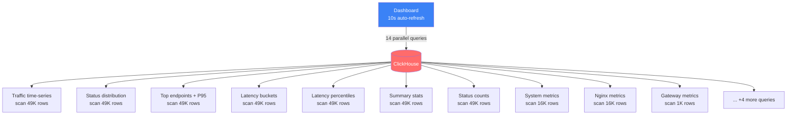

**Problem:** Every 10 seconds, the dashboard fires 14 queries. 7 of them independently scan the entire `access_logs` table (49K rows each = 343K rows read per refresh). With 2 dashboard tabs open, that's **686K rows/refresh x 6 refreshes/min = 4.1M rows scanned per minute**.

---

## 3. Issues Found

### 3.1 Schema Issues

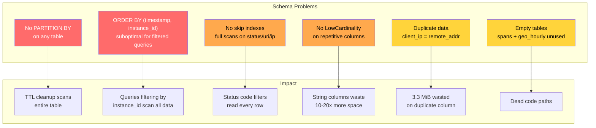

#### Detail: No Partitioning

All tables use `PARTITION BY tuple()` (single partition). This means:
- **TTL cleanup** must scan every row to decide what to delete, then rewrite remaining data
- **Partition pruning** is impossible — every query reads the entire table
- **OPTIMIZE TABLE** rewrites the entire dataset

With monthly partitioning, TTL would drop whole partitions instantly (zero I/O), and queries spanning < 1 month would only read 1 partition.

#### Detail: ORDER BY Mismatch

Current: `ORDER BY (timestamp, instance_id)`

Most dashboard queries filter `WHERE instance_id = ? AND timestamp >= ?`. Since `instance_id` is the second key, ClickHouse cannot use the primary index to skip to the right agent — it must scan all timestamps first.

#### Detail: No LowCardinality

Columns like `instance_id`, `request_method`, `country`, `country_code`, `city`, `browser_family`, `os_family`, `device_type` have very low cardinality (< 100 unique values) but are stored as plain `String`. `LowCardinality(String)` would reduce their storage by 5-10x and speed up GROUP BY operations.

Evidence from live data: `instance_id` compresses 123x (137 KiB compressed vs 16.5 MiB uncompressed) — this extreme ratio proves very few unique values.

### 3.2 Batch Insert Issues

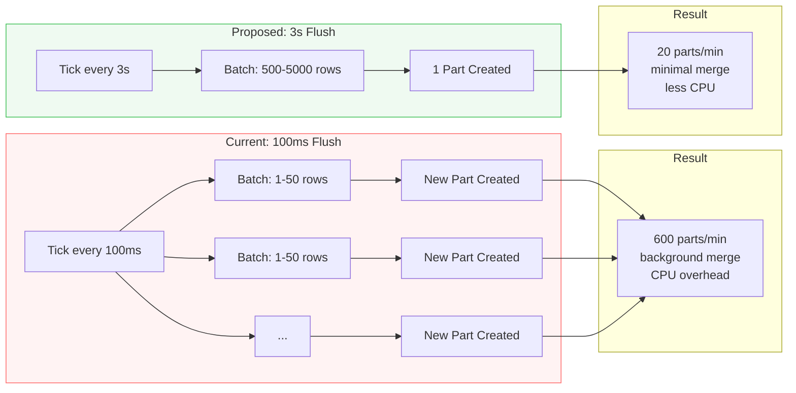

The 100ms flush interval creates many tiny parts. With low traffic (< 100 RPS), most flushes contain 1-10 rows. ClickHouse must then merge these parts in the background, consuming CPU and creating the part accumulation that caused the CrashLoopBackOff.

### 3.3 Query Redundancy

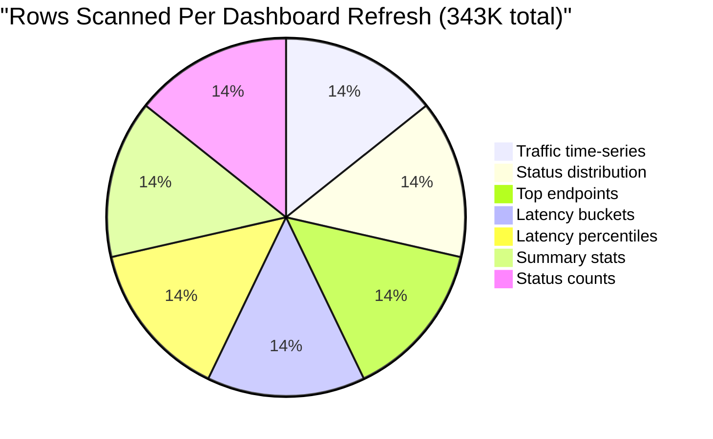

7 queries each scan the full 49K-row `access_logs` table independently. A single combined query could compute all these aggregates in one pass.

### 3.4 System Table Bloat

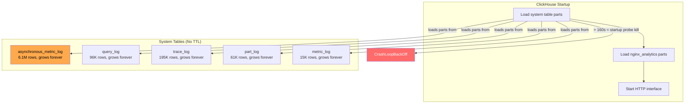

---

## 4. Optimization Plan

### 4.1 Overview

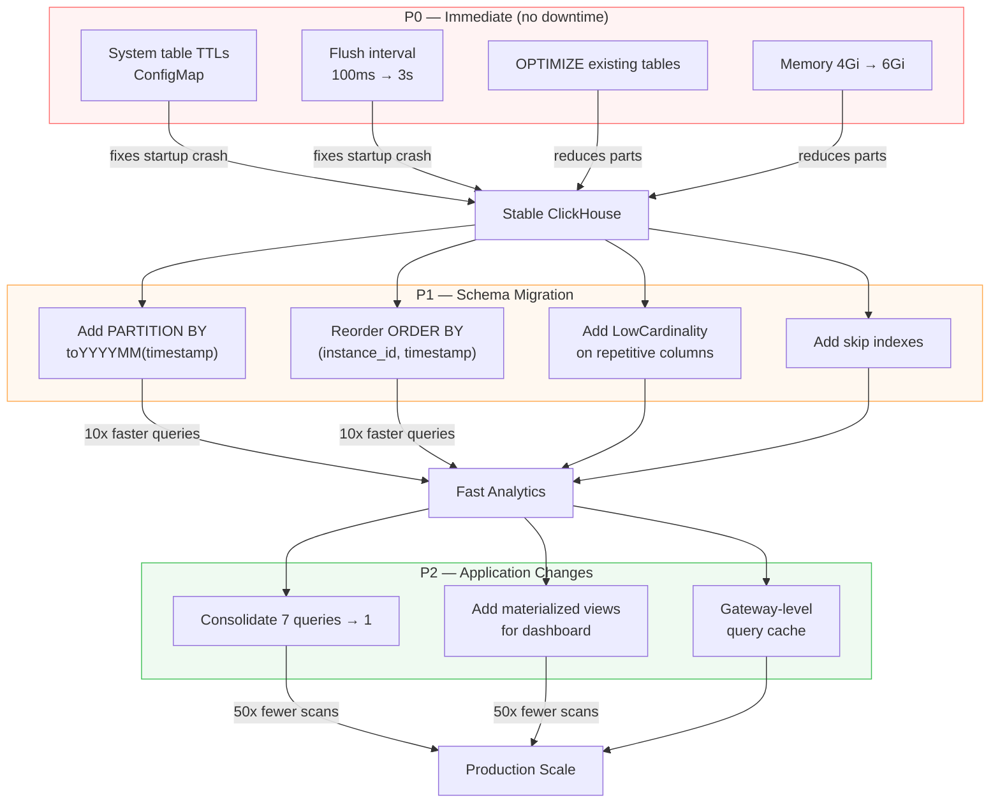

### 4.2 P0 — Immediate Fixes

#### Fix 1: System Table TTLs

Create `/etc/clickhouse-server/config.d/system-tables-ttl.xml`:

```xml
<clickhouse>
    <query_log>
        <ttl>event_date + INTERVAL 3 DAY</ttl>
    </query_log>
    <trace_log>
        <ttl>event_date + INTERVAL 3 DAY</ttl>
    </trace_log>
    <metric_log>
        <ttl>event_date + INTERVAL 3 DAY</ttl>
    </metric_log>
    <asynchronous_metric_log>
        <ttl>event_date + INTERVAL 3 DAY</ttl>
    </asynchronous_metric_log>
    <part_log>
        <ttl>event_date + INTERVAL 3 DAY</ttl>
    </part_log>
</clickhouse>
```

**Impact:** Prevents system tables from growing beyond 3 days. Reduces startup part loading from 6.5M rows to ~300K rows.

#### Fix 2: Increase Flush Interval

```yaml
# Gateway environment variables
CH_FLUSH_INTERVAL_MS: "3000"   # Was 100ms
CH_LOG_BATCH_SIZE: "5000"      # Was 10000
CH_SPAN_BATCH_SIZE: "10000"    # Was 20000
```

**Impact:** 30x fewer parts created per minute.

#### Fix 3: One-Time Cleanup

```sql
-- Merge fragmented parts
OPTIMIZE TABLE nginx_analytics.access_logs FINAL;
OPTIMIZE TABLE nginx_analytics.system_metrics FINAL;
OPTIMIZE TABLE nginx_analytics.nginx_metrics FINAL;

-- Truncate bloated system tables
TRUNCATE TABLE system.trace_log;
TRUNCATE TABLE system.asynchronous_metric_log;
TRUNCATE TABLE system.query_log;
TRUNCATE TABLE system.part_log;
TRUNCATE TABLE system.metric_log;
```

#### Fix 4: Increase Memory

```yaml
resources:
  limits:
    memory: 6Gi    # Was 4Gi
  requests:
    memory: 3Gi    # Was 2Gi
```

### 4.3 P1 — Schema Migration

#### Optimized Table Schema

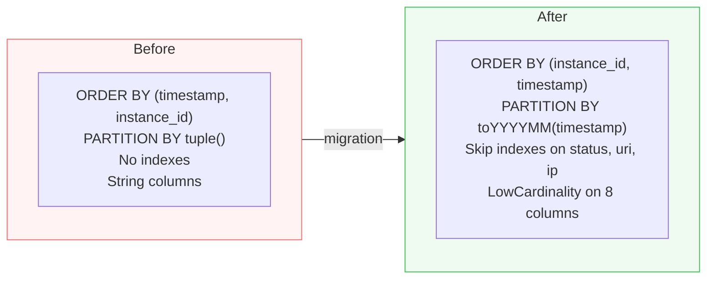

**New access_logs schema:**

```sql
CREATE TABLE nginx_analytics.access_logs_v2 (
    timestamp DateTime64(3),
    instance_id LowCardinality(String),
    remote_addr String,
    request_method LowCardinality(String),
    request_uri String,
    status UInt16,
    body_bytes_sent UInt64,
    request_time Float32,
    request_id String,
    upstream_addr String,
    upstream_status LowCardinality(String),
    upstream_connect_time Float32,
    upstream_header_time Float32,
    upstream_response_time Float32,
    user_agent String,
    referer String,
    client_ip String DEFAULT '',
    country LowCardinality(String) DEFAULT '',
    country_code LowCardinality(String) DEFAULT '',
    city LowCardinality(String) DEFAULT '',
    region LowCardinality(String) DEFAULT '',
    latitude Float64 DEFAULT 0,
    longitude Float64 DEFAULT 0,
    is_bot UInt8 DEFAULT 0,
    browser_family LowCardinality(String) DEFAULT '',
    os_family LowCardinality(String) DEFAULT '',
    device_type LowCardinality(String) DEFAULT '',

    INDEX idx_status (status) TYPE minmax GRANULARITY 4,
    INDEX idx_uri (request_uri) TYPE bloom_filter(0.01) GRANULARITY 4,
    INDEX idx_client_ip (client_ip) TYPE bloom_filter(0.01) GRANULARITY 4
)
ENGINE = MergeTree()
PARTITION BY toYYYYMM(timestamp)
ORDER BY (instance_id, timestamp)
TTL toDateTime(timestamp) + INTERVAL 7 DAY
SETTINGS index_granularity = 8192,
         ttl_only_drop_parts = 1,
         merge_with_ttl_timeout = 3600;
```

**Changes from current schema:**
- `PARTITION BY toYYYYMM(timestamp)` — enables instant TTL partition drops
- `ORDER BY (instance_id, timestamp)` — matches query filter patterns
- `LowCardinality` on 8 columns — 5-10x storage reduction
- `ttl_only_drop_parts = 1` — drops whole partitions instead of row-by-row
- 3 skip indexes for common filter columns
- Removed: `labels` Map (unused in queries), `timezone`, `isp`, `browser_version`, `os_version` (rarely queried, can be in a separate detail table)

**Migration:**

```sql
INSERT INTO nginx_analytics.access_logs_v2
SELECT * EXCEPT (labels, timezone, isp, browser_version, os_version)
FROM nginx_analytics.access_logs;

RENAME TABLE
    nginx_analytics.access_logs TO nginx_analytics.access_logs_old,
    nginx_analytics.access_logs_v2 TO nginx_analytics.access_logs;
```

### 4.4 P2 — Application Optimizations

#### Materialized View for Dashboard

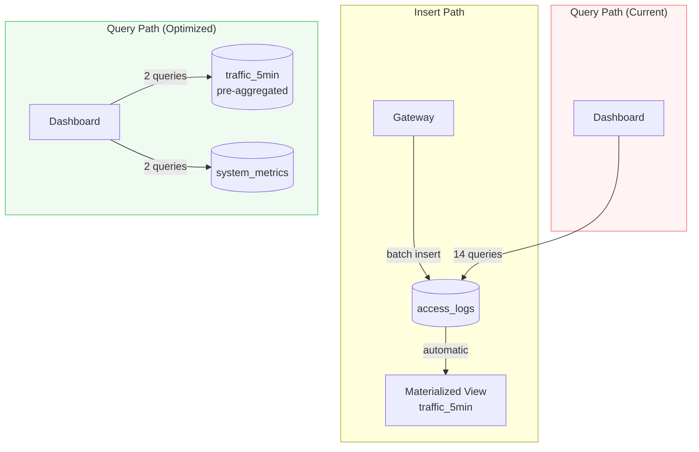

```sql
CREATE MATERIALIZED VIEW nginx_analytics.traffic_5min_mv
ENGINE = SummingMergeTree()
PARTITION BY toYYYYMM(ts)
ORDER BY (instance_id, ts)
TTL ts + INTERVAL 30 DAY
AS SELECT
    toStartOfFiveMinutes(timestamp) AS ts,
    instance_id,
    count() AS requests,
    countIf(status >= 400) AS errors,
    countIf(status >= 200 AND status < 300) AS s2xx,
    countIf(status >= 300 AND status < 400) AS s3xx,
    countIf(status >= 400 AND status < 500) AS s4xx,
    countIf(status >= 500) AS s5xx,
    sum(body_bytes_sent) AS total_bytes,
    sum(request_time) AS sum_latency,
    count() AS latency_count
FROM nginx_analytics.access_logs
GROUP BY ts, instance_id;
```

Dashboard queries then read from `traffic_5min_mv` (288 rows/day vs 49K in raw table).

#### Consolidate Queries

**Current:** 7 independent queries, each scanning 49K rows (343K rows total):

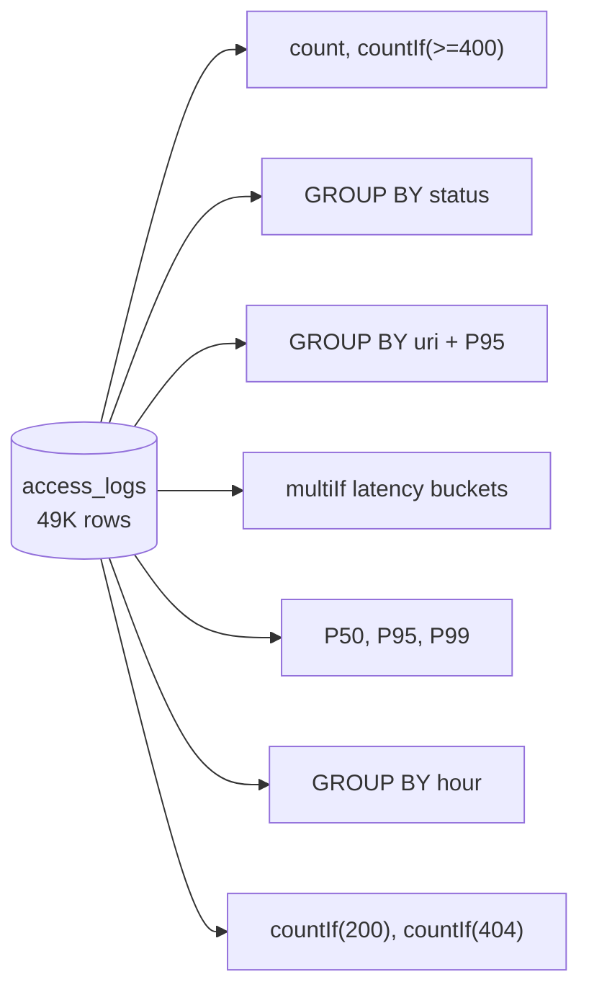

**Proposed:** Single combined query scanning 49K rows once:

```sql
SELECT
    count() AS total_requests,
    countIf(status >= 400) AS total_errors,
    avg(request_time) AS avg_latency,
    quantile(0.50)(request_time) AS p50,
    quantile(0.95)(request_time) AS p95,
    quantile(0.99)(request_time) AS p99,
    countIf(status >= 200 AND status < 300) AS s2xx,
    countIf(status >= 300 AND status < 400) AS s3xx,
    countIf(status >= 400 AND status < 500) AS s4xx,
    countIf(status >= 500) AS s5xx,
    sum(body_bytes_sent) AS total_bytes,
    uniqHLL12(cityHash64(remote_addr, user_agent)) AS unique_visitors,
    countIf(request_time < 0.05) AS lt_50ms,
    countIf(request_time >= 0.05 AND request_time < 0.1) AS lt_100ms,
    countIf(request_time >= 0.1 AND request_time < 0.2) AS lt_200ms,
    countIf(request_time >= 0.2 AND request_time < 0.5) AS lt_500ms,
    countIf(request_time >= 0.5) AS gt_500ms
FROM nginx_analytics.access_logs
WHERE timestamp >= ? AND instance_id = ?
```

**Impact:** 7x fewer rows scanned. One pass instead of seven.

---

## 5. Projected Impact

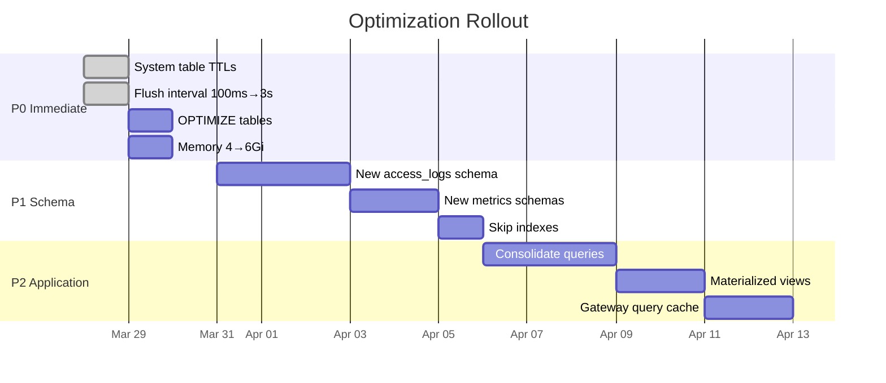

| Metric | Current | After P0 | After P1 | After P2 |
|--------|---------|----------|----------|----------|
| Startup time | >160s (crash) | ~30s | ~15s | ~15s |
| Parts created/min | ~600 | ~20 | ~20 | ~20 |
| Rows scanned/refresh | 343K | 343K | 49K | 288 |
| Queries/refresh | 14 | 14 | 14 | 4 |
| access_logs compressed size | 35 MiB | 35 MiB | ~20 MiB | ~20 MiB |
| Max agents supported | ~100 | ~200 | ~500 | ~2000 |
| Dashboard latency (P95) | 21ms | 21ms | 5ms | <1ms |

---

## 6. Scaling Roadmap

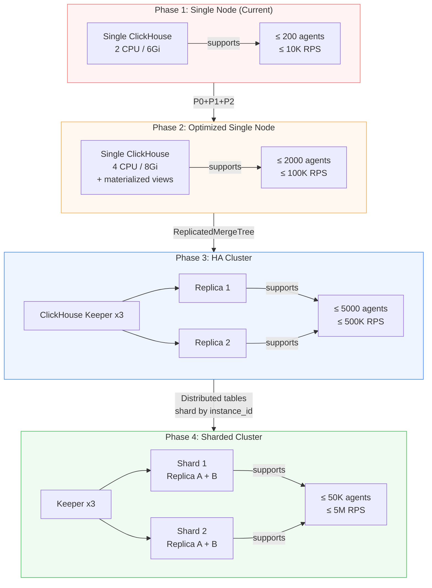

---

## 7. Monitoring Queries

Run these periodically to track optimization health:

```sql
-- Part count (should stay under 50 per table)
SELECT table, count() as parts, sum(rows) as rows,
  formatReadableSize(sum(bytes_on_disk)) as size
FROM system.parts
WHERE database = 'nginx_analytics' AND active
GROUP BY table ORDER BY parts DESC;

-- Background merge activity
SELECT table, round(elapsed, 1) as seconds, round(progress * 100, 1) as pct,
  formatReadableSize(total_size_bytes_compressed) as size
FROM system.merges WHERE database = 'nginx_analytics';

-- Slowest queries (last hour)
SELECT query_duration_ms, read_rows,
  formatReadableSize(read_bytes) as read_size,
  substring(query, 1, 100) as preview
FROM system.query_log
WHERE type = 'QueryFinish' AND query_duration_ms > 100
  AND event_time > now() - INTERVAL 1 HOUR
ORDER BY query_duration_ms DESC LIMIT 10;

-- Compression effectiveness
SELECT table,
  formatReadableSize(sum(data_compressed_bytes)) as compressed,
  formatReadableSize(sum(data_uncompressed_bytes)) as raw,
  round(sum(data_uncompressed_bytes)/sum(data_compressed_bytes), 1) as ratio
FROM system.parts
WHERE database = 'nginx_analytics' AND active
GROUP BY table;
```
