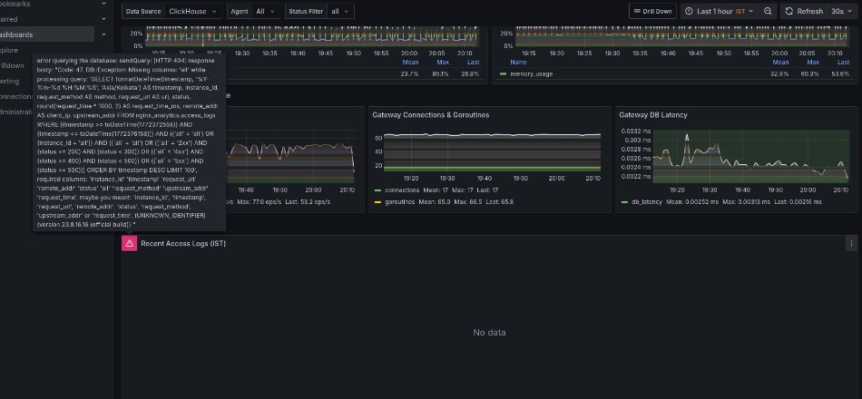
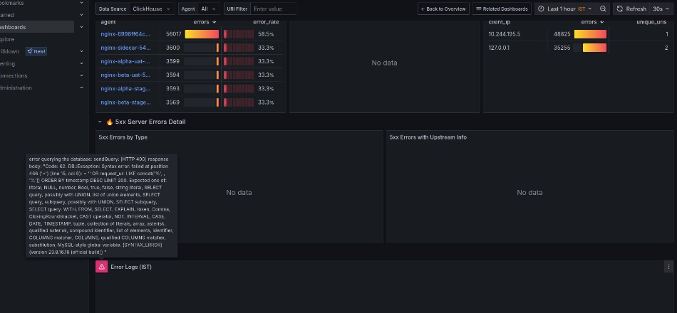
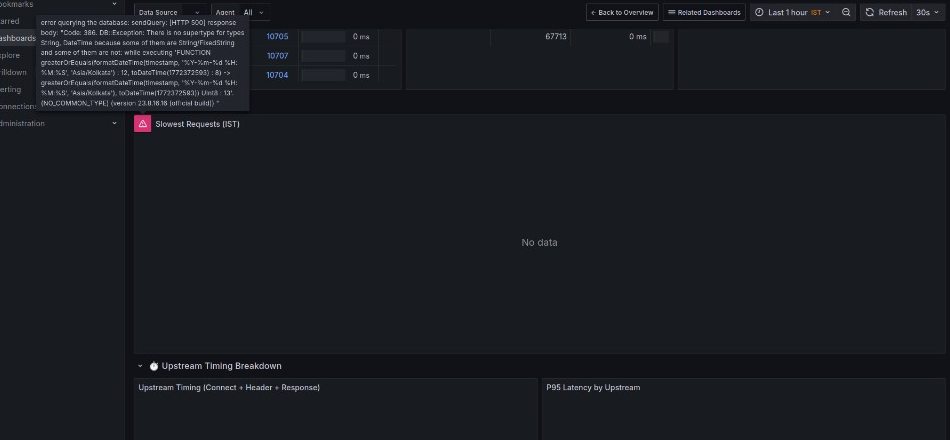

# Avika Grafana Dashboards

Avika provides comprehensive, production-ready Grafana dashboards for monitoring your NGINX fleet. These dashboards are automatically provisioned when deploying with kube-prometheus-stack and provide real-time insights into your infrastructure.

## Dashboard Gallery

### NGINX Manager Overview

The main dashboard provides a bird's-eye view of your entire NGINX fleet with real-time metrics.



**Key Features:**
- **Fleet Status** - Real-time health status of all NGINX agents
- **Request Throughput** - Requests per second across all instances
- **Memory & CPU Usage** - Resource utilization trends
- **Gateway Connections** - Active connections and goroutines
- **Gateway DB Latency** - ClickHouse query performance
- **Access Logs Table** - Live log stream with filtering

---

### Error Analysis Dashboard

Deep dive into HTTP errors across your NGINX fleet with powerful filtering and drill-down capabilities.



**Key Features:**
- **Error Overview** - Total errors, 4xx/5xx breakdown, error rate percentage
- **Error Trends** - Time-series visualization of errors over time
- **Error Distribution** - Pie chart breakdown by status code
- **Top Error URIs** - Most frequently failing endpoints
- **Client IP Analysis** - Identify problematic clients
- **Error Logs** - Detailed error log table with full context

---

### Latency Analysis Dashboard

Comprehensive latency monitoring with percentile analysis and upstream performance tracking.



**Key Features:**
- **Latency Percentiles** - P50, P90, P95, P99 latency metrics
- **Slowest Requests** - Identify performance bottlenecks
- **Upstream Timing** - Connect, header, and response time breakdown
- **Latency Distribution** - Histogram of request latencies
- **Agent Comparison** - Compare latency across NGINX instances
- **URI Performance** - Slowest endpoints by latency

---

## Installation

### Prerequisites

- Kubernetes cluster with kube-prometheus-stack installed
- Grafana sidecar configured to watch all namespaces
- ClickHouse deployed (included in Avika Helm chart)

### Quick Start

1. **Configure kube-prometheus-stack** to enable dashboard discovery:

```yaml
# values.yaml for kube-prometheus-stack
grafana:
  sidecar:
    dashboards:
      enabled: true
      label: grafana_dashboard
      labelValue: "1"
      searchNamespace: ALL
      folderAnnotation: grafana_folder
      provider:
        foldersFromFilesStructure: true
    datasources:
      enabled: true
      searchNamespace: ALL
```

2. **Install Avika** with Grafana integration enabled:

```bash
helm install avika ./deploy/helm/avika -n avika --create-namespace
```

3. **Access Dashboards** - Navigate to Grafana and find the "Avika" folder

---

## Dashboard Variables

All dashboards support dynamic filtering through Grafana variables:

| Variable | Description | Default |
|----------|-------------|---------|
| `DS_CLICKHOUSE` | ClickHouse datasource selector | ClickHouse |
| `agent` | Filter by NGINX agent/instance | All |
| `status_filter` | Filter by HTTP status category | All |
| `uri_filter` | Filter by URI pattern | (empty) |

---

## Data Sources

Dashboards connect to ClickHouse tables in the `nginx_analytics` database:

| Table | Description | Retention |
|-------|-------------|-----------|
| `access_logs` | NGINX access log entries | 30 days |
| `nginx_metrics` | NGINX stub_status metrics | 7 days |
| `system_metrics` | Agent system metrics (CPU, memory) | 7 days |
| `gateway_metrics` | Gateway performance metrics | 7 days |

---

## Customization

### Adding Custom Panels

Dashboards are stored as JSON files in `deploy/helm/avika/dashboards/`. You can:

1. Export modified dashboards from Grafana UI
2. Replace the JSON files in the Helm chart
3. Upgrade the Helm release to apply changes

### Changing Time Zones

Dashboards use `Asia/Kolkata` timezone by default. To change:

1. Edit dashboard JSON files
2. Replace `'Asia/Kolkata'` with your timezone
3. Redeploy the Helm chart

---

## Troubleshooting

### Dashboards Not Appearing

1. Verify Grafana sidecar is configured to watch all namespaces:
   ```bash
   kubectl logs -n monitoring <grafana-pod> -c grafana-sc-dashboard
   ```

2. Check ConfigMap labels:
   ```bash
   kubectl get configmaps -n avika -l grafana_dashboard=1
   ```

### No Data in Panels

1. Verify ClickHouse datasource health:
   ```bash
   kubectl exec -n monitoring <grafana-pod> -c grafana -- \
     curl -s 'http://localhost:3000/api/datasources/uid/DS_CLICKHOUSE/health'
   ```

2. Check if data exists in ClickHouse:
   ```bash
   kubectl exec -n avika <clickhouse-pod> -- \
     clickhouse-client --query "SELECT count() FROM nginx_analytics.access_logs"
   ```

### Dashboards in Wrong Folder

Ensure `foldersFromFilesStructure: true` is set under `grafana.sidecar.dashboards.provider` in your kube-prometheus-stack values.

---

## Architecture

```
┌─────────────────────────────────────────────────────────────────┐
│                         Grafana                                  │
│  ┌─────────────┐  ┌─────────────┐  ┌─────────────┐              │
│  │   Overview  │  │   Errors    │  │   Latency   │              │
│  │  Dashboard  │  │  Dashboard  │  │  Dashboard  │              │
│  └──────┬──────┘  └──────┬──────┘  └──────┬──────┘              │
│         │                │                │                      │
│         └────────────────┼────────────────┘                      │
│                          │                                       │
│                          ▼                                       │
│              ┌───────────────────────┐                          │
│              │  ClickHouse Datasource │                          │
│              │    (DS_CLICKHOUSE)     │                          │
│              └───────────┬───────────┘                          │
└──────────────────────────┼──────────────────────────────────────┘
                           │
                           ▼
┌──────────────────────────────────────────────────────────────────┐
│                      ClickHouse                                   │
│  ┌──────────────┐  ┌──────────────┐  ┌──────────────┐            │
│  │ access_logs  │  │nginx_metrics │  │system_metrics│            │
│  └──────────────┘  └──────────────┘  └──────────────┘            │
└──────────────────────────────────────────────────────────────────┘
                           ▲
                           │
┌──────────────────────────┼──────────────────────────────────────┐
│                    Avika Gateway                                 │
│         (Receives data from NGINX Agents)                        │
└──────────────────────────────────────────────────────────────────┘
                           ▲
                           │
        ┌──────────────────┼──────────────────┐
        │                  │                  │
        ▼                  ▼                  ▼
┌──────────────┐  ┌──────────────┐  ┌──────────────┐
│ NGINX Agent  │  │ NGINX Agent  │  │ NGINX Agent  │
│  (Pod 1)     │  │  (Pod 2)     │  │  (Pod N)     │
└──────────────┘  └──────────────┘  └──────────────┘
```

---

## Contributing

We welcome contributions to improve the dashboards! Please:

1. Fork the repository
2. Create a feature branch
3. Make your changes to the dashboard JSON files
4. Test in a local environment
5. Submit a pull request

---

## License

Apache License 2.0 - See [LICENSE](../LICENSE) for details.
