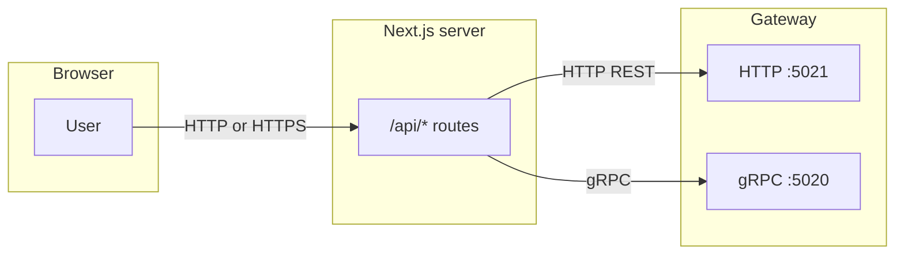
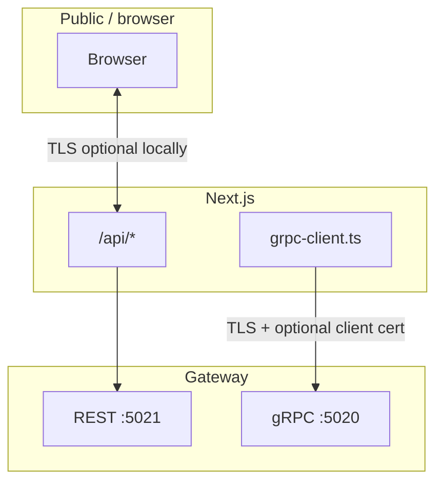
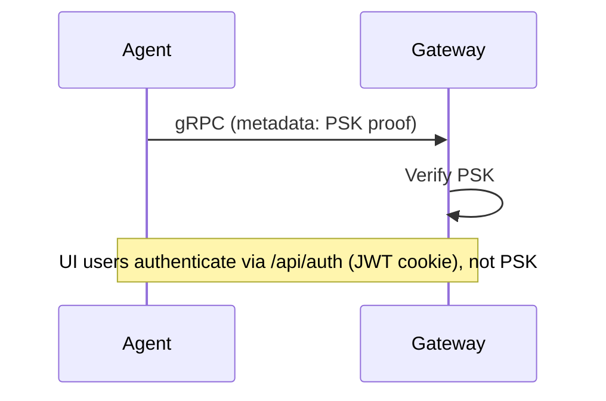
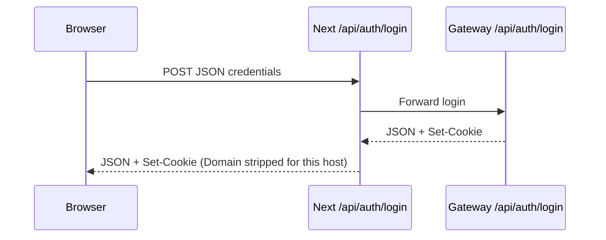

# Avika — Quick reference: HTTP/S, gRPC, TLS, mTLS, PSK

This page summarizes how traffic flows, where configuration lives, how to create certificates, and how PSK fits in. For deeper RCA context, see [TLS_PSK_INVENTORY_RCA_AND_FIX_PLAN.md](./TLS_PSK_INVENTORY_RCA_AND_FIX_PLAN.md).

---

## 1. Architecture (who talks to whom)

### Browser ↔ Next.js (BFF)

The UI uses **HTTP or HTTPS** to your Next app only. It does **not** open a raw gRPC connection to the gateway from the browser for dashboard flows; it calls same-origin routes like `/api/servers`, `/api/auth/login`, `/api/analytics`.



### Two “layers” of TLS

| Layer | Path | Protocol | What it protects |
|-------|------|----------|------------------|
| **A. UI transport** | Browser → Next | HTTP **or** HTTPS | Cookies, login, same-origin API calls. Use **HTTPS** in production; locally use `--experimental-https` or a reverse proxy. |
| **B. BFF → gateway (gRPC)** | Next server → Gateway | Plain gRPC **or** gRPC **over TLS** (**mTLS** optional) | Internal hop: analytics, optional `ListAgents`, etc. Configured with `GATEWAY_GRPC_*` and TLS env vars on the **Next.js process** (see §3). |



---

## 2. HTTP vs HTTPS — what to use where

| Surface | Typical dev | Production |
|---------|-------------|------------|
| **Next.js dev server** | `http://localhost:3000` | N/A (use `next start` behind ingress) |
| **Next with TLS locally** | `https://localhost:3000` via `next dev --experimental-https` (see §5 script) | Same pattern or terminate TLS at ingress |
| **Gateway REST** | `http://localhost:5021` | `https://...` behind LB or cluster Service |
| **Gateway gRPC** | `localhost:5020` (often plain) | TLS in-cluster or with certs |

**Cookies:** Session cookies may be marked `Secure`; testing login flows realistically often needs **HTTPS** for the Next origin.

**Base path:** If the app is served under a subpath (e.g. `/avika`), set **`NEXT_PUBLIC_BASE_PATH=/avika`** at build time and align **`next.config` `basePath`**. The login and `apiFetch` paths must include that prefix (see `getBasePath()` in `frontend/src/lib/api.ts`).

---

## 3. Where each configuration goes

### Next.js (frontend) — env read at dev/build/runtime

| Variable | Purpose |
|----------|---------|
| `GATEWAY_HTTP_URL` / `GATEWAY_URL` | Server-side HTTP proxy to gateway (auth, inventory HTTP, etc.). **First wins:** `GATEWAY_HTTP_URL`. Default in code: `http://localhost:5021`. |
| `GATEWAY_GRPC_ADDR` | Host:**port** for gRPC (no `http://`). Example: `localhost:5020` or `avika-gateway.avika.svc.cluster.local:5020`. |
| `GATEWAY_EXTERNAL_URL` | Optional; exposed via `/api/config` for browser WebSockets / terminal when the browser must use a different host than the BFF. |
| `ENABLE_TLS` or `GATEWAY_TLS` | Set to `true` to use **TLS** on the gRPC channel to the gateway. |
| `TLS_CA_CERT_FILE` | PEM CA bundle to verify the gateway server cert (private CA). |
| `TLS_CLIENT_CERT_FILE` + `TLS_CLIENT_KEY_FILE` | **Both or neither:** client certificate + key for **mTLS** (gateway verifies Next). Aliases: `GRPC_TLS_CLIENT_CERT_FILE` / `GRPC_TLS_CLIENT_KEY_FILE`. |
| `NEXT_PUBLIC_BASE_PATH` | Subpath for the app (e.g. `/avika`); must match deployment. |
| `NEXT_PUBLIC_MOCK_BACKEND` | `true` = no real gateway (mock data in `api.ts`). |

Resolved in: `frontend/src/lib/gateway-url.ts`, `frontend/src/lib/grpc-client.ts`, `frontend/.env.local.example`.

### Gateway (Go) — env / Helm / YAML

| Variable / field | Purpose |
|------------------|---------|
| `ENABLE_TLS` | Gateway serves gRPC **and** relevant HTTP with TLS when `true`. |
| `TLS_CERT_FILE` / `TLS_KEY_FILE` | Server certificate and key for the gateway. |
| `TLS_CA_CERT_FILE` | CA for verifying **client** certificates when requiring mTLS. |
| `REQUIRE_CLIENT_CERT` | `true` = gateway requires client certs (mTLS) on TLS connections. |
| `DB_DSN` | Postgres (or configured driver) connection string. |
| `CLICKHOUSE_*` | ClickHouse address, database, user, password, etc. |
| `PSK_ENABLED`, `PSK_KEY`, `PSK_ALLOW_AUTO_ENROLL`, `PSK_TIMESTAMP_WINDOW`, `PSK_REQUIRE_HOST_MATCH` | Pre-shared key auth for **agents** on gRPC (see §6). |

Source: `cmd/gateway/config/config.go`, `deploy/helm/avika/values.yaml`.

### Agent — flags / env

| Variable / flag | Purpose |
|-----------------|---------|
| `PSK_KEY` / `-psk` | Hex-encoded shared key (must match gateway `PSK_KEY`). |
| TLS flags / env | Agent connects to gateway with TLS when enabled (see agent `main.go` and deploy docs). |

---

## 4. Certificates — generate, trust, and store

### Principles

- **Never commit** private keys or real certs to git (repo `.gitignore` already ignores common patterns such as `*.pem`, `*.key`).
- **Recommended local directory:** create a folder **outside** the repo or use **`certs/local/`** under the repo for throwaway dev material — treat it as **secrets** and keep it untracked.

### Option A — mkcert (trusted in browser, best UX)

```bash
mkcert -install
mkdir -p certs/local
mkcert -key-file certs/local/next-dev-key.pem -cert-file certs/local/next-dev.pem localhost 127.0.0.1 ::1
```

Use these paths with:

```bash
npx next dev --experimental-https \
  --experimental-https-key ./certs/local/next-dev-key.pem \
  --experimental-https-cert ./certs/local/next-dev.pem
```

### Option B — OpenSSL (self-signed; browser warning until accepted)

```bash
mkdir -p certs/local
openssl req -x509 -newkey rsa:2048 \
  -keyout certs/local/next-dev-key.pem \
  -out certs/local/next-dev.pem \
  -days 365 -nodes \
  -subj "/CN=localhost"
```

### gRPC TLS / mTLS (gateway ↔ Next)

1. **Server cert:** usual PEM cert + key on the **gateway** (`TLS_CERT_FILE`, `TLS_KEY_FILE`).
2. **Client trusts server:** Next sets `TLS_CA_CERT_FILE` to the CA that signed the gateway cert (or public chain).
3. **mTLS:** Issue a **client** cert signed by a CA the gateway trusts; place PEM + key paths in `TLS_CLIENT_CERT_FILE` and `TLS_CLIENT_KEY_FILE` on **Next**. Gateway may set `REQUIRE_CLIENT_CERT=true` and `TLS_CA_CERT_FILE` to the CA that signed client certs.

Store these PEMs in a secure directory (e.g. `certs/grpc-dev/` locally), not in git.

---

## 5. Local HTTPS helper script

Interactive setup (gateway URLs, optional DB/ClickHouse lines for reference, TLS flags, optional cert generation):

```bash
./scripts/dev-https-local.sh
```

The script writes a **snippet file** you can merge into `frontend/.env.local` (it does not overwrite `.env.local` without confirmation). See `scripts/README.md` for details.

---

## 6. PSK (Pre-Shared Key) — what it does and how to use it

**Purpose:** Authenticate **nginx agents** to the **gateway** over gRPC using a shared secret (HMAC-style metadata), not for human UI login.

| Component | What you set |
|-----------|----------------|
| **Gateway** | `PSK_ENABLED=true`, `PSK_KEY=<hex>` (generate e.g. `openssl rand -hex 32`). Optional: `PSK_ALLOW_AUTO_ENROLL`, `PSK_TIMESTAMP_WINDOW`, `PSK_REQUIRE_HOST_MATCH`. Helm: `psk` in `values.yaml` or existing Kubernetes Secret. |
| **Agent** | Same key: env `PSK_KEY` or flag `-psk`, aligned with gateway. |

**Important:** When PSK is enabled, gateway gRPC interceptors may affect **all** unary/stream calls unless scoped; the UI BFF uses gRPC for some routes. If inventory or analytics breaks after enabling PSK, see [TLS_PSK_INVENTORY_RCA_AND_FIX_PLAN.md](./TLS_PSK_INVENTORY_RCA_AND_FIX_PLAN.md) (HTTP inventory fallback, interceptor scope).



---

## 7. Summary table

| Topic | Where configured |
|-------|------------------|
| Browser uses HTTP vs HTTPS | URL you open; Next `next dev --experimental-https` or ingress |
| BFF → gateway HTTP | `GATEWAY_HTTP_URL` on **Next** |
| BFF → gateway gRPC plain vs TLS | `ENABLE_TLS` / `GATEWAY_TLS`, `TLS_CA_CERT_FILE`, client cert env on **Next** |
| Gateway TLS termination | `ENABLE_TLS`, `TLS_CERT_FILE`, `TLS_KEY_FILE`, `TLS_CA_CERT_FILE`, `REQUIRE_CLIENT_CERT` on **gateway** |
| Postgres / ClickHouse | `DB_DSN`, `CLICKHOUSE_*` on **gateway** |
| Agent PSK | `PSK_*` on **gateway**; `PSK_KEY` / `-psk` on **agent** |

---

## 8. `frontend/src/lib/api.ts` — base path, mocks, server IDs

### Runtime base path (`getBasePath`)

| Input | Result |
|-------|--------|
| `NEXT_PUBLIC_BASE_PATH` set at build | Use that value (e.g. `/avika`). |
| In the **browser**, path starts with `/avika`, env empty | Use `/avika` so API calls work even if the build forgot the env. |
| Otherwise | `""` (root). |

`apiFetch()` and `apiUrl()` call `getBasePath()` so `/api/...` requests stay under the same subpath as the UI.

### Mock backend (`NEXT_PUBLIC_MOCK_BACKEND=true`)

| Route | Notes |
|-------|--------|
| `/api/analytics` | Mock uses **`summary`**, **`request_rate`**, **`status_distribution`**, **`top_endpoints`** — same general shape as the real BFF/gateway response (not legacy `totals` / empty `timeseries`). |
| `/api/servers` | Only the **list** URL matches (not `/api/servers/:id`). Agents include `agent_id`, `ip`, `version`, `last_seen`, etc. |
| `/api/config` | Mock `httpUrl` / `wsUrl` point at `localhost:5021` for local demos. |

### Server / agent ID helpers

| Function | Behavior |
|----------|----------|
| `normalizeServerId(id)` | Turns spaces into `+` after URL decoding. Does **not** turn every `-` into `+` (that broke IDs containing hyphens). |
| `serverIdForDisplay(id)` | `+` → `-`, and `.` → `-` for safe path segments and display. |

---

## 9. Gateway URL — not hardcoded to a hostname

There is **no** production domain baked into the frontend.

| Piece | Where it comes from | Default if unset |
|-------|---------------------|------------------|
| HTTP proxy to gateway (Next server) | `GATEWAY_HTTP_URL` → `GATEWAY_URL` | `http://localhost:5021` (`gateway-url.ts`) |
| gRPC client (Next server) | `GATEWAY_GRPC_ADDR` (+ TLS envs) | `localhost:5020` (`grpc-client.ts`) |
| Browser terminal WebSocket | Often **`window.location.hostname:5021`** in `TerminalOverlay.tsx` | Assumes gateway WS reachable on **port 5021** on the same host as the page — adjust ingress or env if your gateway is elsewhere. |

Set the **Next.js** env vars in `frontend/.env.local` (see `frontend/.env.local.example`).

---

## 10. Login, session cookie, and subpath (`/avika`)

### Flow (short)



Session cookie name: **`avika_session`**. BFF routes forward it to the gateway as `Cookie:` on server-side requests.

### Subpath deployments

| Symptom | Likely cause |
|---------|----------------|
| **“Failed to connect to server”** on submit (no HTTP body) | `fetch` threw — often **wrong URL** (e.g. POST to `https://host/api/auth/login` instead of `https://host/avika/api/auth/login` when the app only exists under `/avika`). |
| Firefox **`NS_ERROR_MODULE_SECURITY`** in ~1 ms | TLS/security layer failed before a response — often **wrong host/path** or cert mismatch on whatever answered that URL. |

**Fix:** Set **`NEXT_PUBLIC_BASE_PATH=/avika`** at build when serving under `/avika`, and align **`next.config` `basePath`**. The login page uses **`getBasePath()`** (same logic as `api.ts`) so runtime inference still posts to `/avika/api/auth/login` when the pathname starts with `/avika` even if the env was missing.

### HTTPS and cookies

If the gateway sets **`Secure`** cookies, use **HTTPS** for the Next origin when testing (§4–§5).

---

*Document version: 1.1 — adds frontend `api.ts`, gateway URL defaults, login/subpath notes; core TLS/gRPC content unchanged.*
