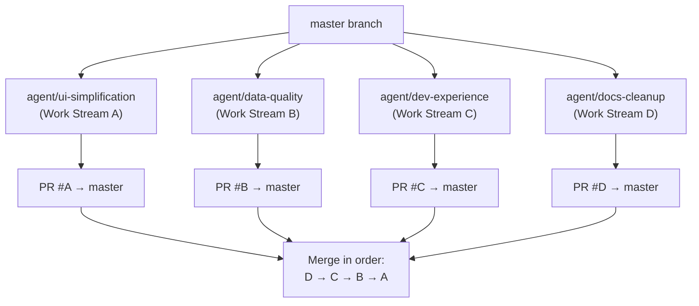

# Avika NGINX Manager — Deep Analysis & Implementation Plan

**Date**: 2026-03-05  
**Role**: Principal Architect / SRE / Developer / UI-UX Engineer  
**Live Instance**: http://10.106.132.138:5031/avika (v1.12.0)

---

## Table of Contents

1. [UI/UX Analysis — Reducing User Overwhelm](#1-uiux-analysis--reducing-user-overwhelm)
2. [Feature Status — Implemented vs Pending (Updated)](#2-feature-status--implemented-vs-pending-updated)
3. [Redundancy Analysis](#3-redundancy-analysis)
4. [Hardcoded Values Audit](#4-hardcoded-values-audit)
5. [Prioritized Implementation Plan (Agent-Assignable)](#5-prioritized-implementation-plan-agent-assignable)
6. [Multi-Agent Coordination Strategy](#6-multi-agent-coordination-strategy)

---

## 1. UI/UX Analysis — Reducing User Overwhelm

### Live UI Screenshots

````carousel

<!-- slide -->

<!-- slide -->

<!-- slide -->

<!-- slide -->

<!-- slide -->

````

### 🔴 Problem: Sidebar Information Overload

The sidebar has **7 sections** and **21+ navigation items** (when all expanded) which creates significant cognitive load:

```
OVERVIEW (3)          → Dashboard, System Health, Monitoring
INFRASTRUCTURE (2)    → Inventory, Provisions
ANALYTICS (4)         → Dashboard, Traces, Visitor Analytics, Geo Analytics
OBSERVABILITY (2)     → Grafana, Alerts
INTELLIGENCE (2)      → AI Tuner [Beta], Reports
ADMIN (1)             → Audit Logs
SETTINGS (7)          → General, Integrations, LLM, WAF, SSO, LDAP, SAML
```

> [!IMPORTANT]
> **21 sidebar items is 2-3x more than industry leaders.** Grafana Cloud has ~8 top-level items, Datadog ~10. The user sees everything at once which creates decision paralysis.

### Recommended Sidebar Restructure

| Current Section | Proposed Merge | Rationale |
|----------------|---------------|-----------|
| OVERVIEW + ANALYTICS | **Operations** (5 items) | Dashboard, Monitoring, Analytics, Traces, Alerts |
| Visitor Analytics + Geo Analytics | Move **under** Analytics as sub-tabs | These are analytics sub-views, not top-level destinations |
| OBSERVABILITY | **Merge into Operations** | Grafana is a deep link; Alerts belong with Monitoring |
| INTELLIGENCE | **Rename to "AI"** or move Reports to Operations | Reports is more operational than intelligent |
| SETTINGS (7 items) | **Collapse to 2**: Settings, Security | SSO/LDAP/SAML are sub-pages of Security, not top-level items |
| System Health | **Keep in Overview** but remove Agent Fleet from it | Agent Fleet = Inventory; don't duplicate |

**Proposed simplified sidebar (12 items, ~3 sections):**

```
OPERATIONS (6)
  → Dashboard, Monitoring, Analytics, Alerts, Reports, Inventory

MANAGEMENT (3)
  → Provisions, AI Tuner [Beta], Audit Logs

SETTINGS (3)
  → General, Integrations, Security (SSO/LDAP/SAML/WAF)
```

### Other UI/UX Issues

| # | Issue | Severity | Current State | Fix |
|---|-------|----------|---------------|-----|
| 1 | **Agent Fleet table duplicated** on Dashboard (bottom), System Health, and Inventory pages | **High** | 3 separate implementations of agent listing | Make Inventory the single source; remove from System Health and Dashboard (keep a summary KPI card on Dashboard) |
| 2 | **NGINX version shows "unknown"** for all K8s agents | **High** | All 9 agents show `unknown` | Backend issue — agent not reporting NGINX version correctly |
| 3 | **PostgreSQL/ClickHouse show "vN/A"** on System Health | **Medium** | Missing version detection | Backend `/api/health` needs to return component versions |
| 4 | **"No connection data available"** on Monitoring | **Medium** | Empty Connection Distribution chart | NGINX stub status may not include connection breakdown |
| 5 | **Search bar (⌘K) is non-functional** | **Medium** | Rendered but no handler attached | Implement command palette or remove placeholder |
| 6 | **Notification bell has permanent blue dot** | **Low** | Hardcoded `<span className="w-2 h-2 bg-blue-500 rounded-full" />` | Only display when there are unread notifications |
| 7 | **"Update Available" badge on every agent** | **Medium** | All 9/9 agents show Update badge | Check agent version vs latest version properly — suppress badge if current |
| 8 | **Error rate 70%+ without explanation** | **High** | Dashboard shows 70.76% 4xx errors — no context | Add a dismissible info tooltip "This may include expected 4xx responses (auth, rate limiting). [Configure thresholds]" |
| 9 | **0ms Avg Latency** is suspicious | **Medium** | P50 shows as 0ms | Either a measurement issue or NGINX not providing timing data |
| 10 | **Help (?) and Notifications (🔔) buttons are non-functional** | **Low** | Rendered but no handlers | Wire to help docs / notification panel or remove |

---

## 2. Feature Status — Implemented vs Pending (Updated March 2026)

### ✅ Issues Fixed Since Last Analysis (2026-03-03)

These were previously P0/P1 issues that are now **resolved**:

| Previously Reported Issue | Status Now |
|----------------------------|------------|
| `UserSettingsProvider` not in [layout.tsx](file:///home/dk/Documents/git/nginx-manager-cursor/frontend/src/app/layout.tsx) | ✅ **FIXED** — wired as 4th provider in layout |
| `localhost:5050` in 5 API routes | ✅ **FIXED** — centralized to [getGatewayUrl()](file:///home/dk/Documents/git/nginx-manager-cursor/frontend/src/lib/gateway-url.ts#1-16) → `localhost:5021` |
| In-code TODOs in [cmd/gateway/main.go](file:///home/dk/Documents/git/nginx-manager-cursor/cmd/gateway/main.go) | ✅ **FIXED** — no TODOs found in gateway or frontend code |
| Settings page monolithic (600+ lines) | ✅ **FIXED** — refactored to 6 sub-components (274 lines main) |
| Raw HTML `<select>` elements | ✅ **FIXED** — replaced with standardized Select/DropdownMenu |
| Telemetry/AI inputs not state-bound | ✅ **FIXED** — useState-driven with `updateSettings()` call |
| Toaster hardcoded to `theme="dark"` | ✅ **FIXED** — uses `ThemeProvider`-aware `Toaster` component |
| LDAP/SAML/OIDC missing | ✅ **IMPLEMENTED** — SSO config, LDAP, SAML pages exist |
| No breadcrumb navigation | ✅ **FIXED** — Breadcrumb component in header |
| Escaped quote in UI | ✅ **FIXED** — not visible in current build |
| mTLS missing | ✅ **IMPLEMENTED** per [IMPLEMENTED_VS_PENDING.md](file:///home/dk/Documents/git/nginx-manager-cursor/docs/IMPLEMENTED_VS_PENDING.md) |
| HPA/PDB missing | ✅ **IMPLEMENTED** in Helm charts |
| Notification integrations (Teams, PagerDuty) | ✅ **IMPLEMENTED** via webhooks + SMTP |

### ⚠️ Still Pending Issues

| # | Issue | Priority | Detail |
|---|-------|----------|--------|
| 1 | **AI Engine disabled** (`replicaCount: 0`) | P1 | Optimization page shows nothing |
| 2 | **Kafka consumer noise** | P2 | Error logs every 15s when Redpanda unavailable |
| 3 | **Frontend gRPC default** | P2 | Still defaults to `avika-gateway:5020` (K8s-only) |
| 4 | **gateway.yaml in root** | P3 | Outdated ports 50051/50053 |
| 5 | **Binary version mismatch** | P3 | `v0.0.1-dev` despite VERSION file saying `0.1.45` |
| 6 | **Integration test DB creds** | P3 | 17 tests fail without `TEST_DSN` |
| 7 | **Legacy port precedence** in gateway config | P2 | `WSPort` takes precedence over `HTTPPort` |
| 8 | **Agent Fleet table duplication** (3 pages) | P1 | See UI/UX analysis above |
| 9 | **NGINX version shows "unknown"** | P1 | All K8s agents report unknown NGINX version |
| 10 | **Search/Cmd+K not functional** | P2 | UI element exists but no logic |
| 11 | **Sidebar has too many items (21)** | P1 | See restructure proposal above |

---

## 3. Redundancy Analysis

### Code Redundancies

| Redundancy | Locations | Impact | Action |
|-----------|-----------|--------|--------|
| **Agent Fleet table** duplicated across 3 pages | [page.tsx](file:///home/dk/Documents/git/nginx-manager-cursor/frontend/src/app/page.tsx), [system/page.tsx](file:///home/dk/Documents/git/nginx-manager-cursor/frontend/src/app/system/page.tsx), [inventory/page.tsx](file:///home/dk/Documents/git/nginx-manager-cursor/frontend/src/app/inventory/page.tsx) | Maintenance burden; inconsistent columns | Extract `<AgentFleetTable>` component; use only on Inventory; show summary card elsewhere |
| **Settings link** appears 3 times | Sidebar nav section, sidebar footer, user dropdown menu | Minor visual noise | Keep sidebar section + user dropdown menu; remove footer duplicate |
| **System Health page + Monitoring page overlap** | Both show KPI cards of error rate, latency, request rate | Confusing which page to use | Monitoring = real-time telemetry; System Health = infrastructure status. Make them clearly distinct |
| **Dashboard KPI cards + Analytics KPI cards** | Dashboard shows 4 KPIs; Analytics Overview shows 8 KPIs (4 overlap) | Data inconsistency between pages | Dashboard should be summary-only linking to Analytics for detail |
| **[system/preview/page.tsx](file:///home/dk/Documents/git/nginx-manager-cursor/frontend/src/app/system/preview/page.tsx)** exists alongside [system/page.tsx](file:///home/dk/Documents/git/nginx-manager-cursor/frontend/src/app/system/page.tsx) | Two complete System Health implementations | Dead code | Remove preview if feature is stable, or gate behind feature flag |

### Documentation Redundancies

| File | Lines | Overlaps With | Action |
|------|-------|---------------|--------|
| [IMPLEMENTED_VS_PENDING.md](file:///home/dk/Documents/git/nginx-manager-cursor/docs/IMPLEMENTED_VS_PENDING.md) | 77 | [FEATURE_STATUS.md](file:///home/dk/Documents/git/nginx-manager-cursor/docs/FEATURE_STATUS.md), [avika_deep_analysis.md](file:///home/dk/Documents/git/nginx-manager-cursor/docs/avika_deep_analysis.md) | Consolidate into single [FEATURE_STATUS.md](file:///home/dk/Documents/git/nginx-manager-cursor/docs/FEATURE_STATUS.md) |
| [AVIKA_LOGIN_TEST_REPORT.md](file:///home/dk/Documents/git/nginx-manager-cursor/AVIKA_LOGIN_TEST_REPORT.md) | 244 | [PASSWORD_CHANGE_FLOW_TEST.md](file:///home/dk/Documents/git/nginx-manager-cursor/PASSWORD_CHANGE_FLOW_TEST.md), [TESTING_SUMMARY.md](file:///home/dk/Documents/git/nginx-manager-cursor/TESTING_SUMMARY.md) | Archive to `/docs/archive/` |
| [TEST_REPORT_2026-02-17.md](file:///home/dk/Documents/git/nginx-manager-cursor/TEST_REPORT_2026-02-17.md) | 349 | [TEST_REPORT_2026-03-03.md](file:///home/dk/Documents/git/nginx-manager-cursor/TEST_REPORT_2026-03-03.md), [TEST_SUMMARY_REPORT.md](file:///home/dk/Documents/git/nginx-manager-cursor/TEST_SUMMARY_REPORT.md) | Keep latest only; archive older |
| Multiple TODO docs in `/docs/` | 5 files | `TODO.md` in root | Consolidate TODOs into project board / issues |

---

## 4. Hardcoded Values Audit

### Current Hardcoded Values

| Value | Location | Status | Risk |
|-------|----------|--------|------|
| `avika-gateway:5020` | [grpc-client.ts L41](file:///home/dk/Documents/git/nginx-manager-cursor/frontend/src/lib/grpc-client.ts#L41) | ⚠️ Still present | K8s-only fallback; breaks local dev |
| `monitoring-grafana.monitoring.svc.cluster.local` | [user-settings.tsx L25](file:///home/dk/Documents/git/nginx-manager-cursor/frontend/src/lib/user-settings.tsx#L25) | ℹ️ Acceptable | Default for K8s; overridable via settings |
| `127.0.0.1:8080` upstream placeholder | [provisions.ts L11](file:///home/dk/Documents/git/nginx-manager-cursor/frontend/src/lib/provisions.ts#L11) | ℹ️ Acceptable | Template placeholder, not runtime |
| `admin/admin` SHA-256 default creds | [auth flow](file:///home/dk/Documents/git/nginx-manager-cursor/cmd/gateway/main.go) | ⚠️ Known risk | Force-change already implemented ✅ |
| Permanent blue notification dot | [dashboard-layout.tsx L339](file:///home/dk/Documents/git/nginx-manager-cursor/frontend/src/components/dashboard-layout.tsx#L339) | ⚠️ UX issue | Hardcoded `bg-blue-500` always visible |
| `50051/50053` in root `gateway.yaml` | [gateway.yaml](file:///home/dk/Documents/git/nginx-manager-cursor/gateway.yaml) | ⚠️ Stale config | Should be 5020/5021 or removed |

### Previously Hardcoded — Now Fixed ✅

| Value | Old Location | Fix |
|-------|-------------|-----|
| `localhost:5050` in API routes | 5 API route files | Centralized to `getGatewayUrl()` |
| `collection_interval: 10` POST body | Settings page | Now reads from React state |
| Toaster `theme="dark"` | `layout.tsx` | Uses themed Toaster component |
| Raw HTML `<select>` | Settings page | Replaced with DropdownMenu |

---

## 5. Prioritized Implementation Plan (Agent-Assignable)

### Work Stream A: UI/UX Simplification (Frontend-Only)

> **Scope**: Sidebar, navigation, component consolidation  
> **Files modified**: Frontend only  
> **Risk**: Low — cosmetic changes, no backend impact

| Task | Files | Priority | Est. |
|------|-------|----------|------|
| A1. Restructure sidebar (21 → ~12 items) | [dashboard-layout.tsx](file:///home/dk/Documents/git/nginx-manager-cursor/frontend/src/components/dashboard-layout.tsx) | P1 | 2h |
| A2. Extract shared `<AgentFleetTable>` component | New `components/agent-fleet-table.tsx` | P1 | 3h |
| A3. Remove Agent Fleet from Dashboard & System Health | [page.tsx](file:///home/dk/Documents/git/nginx-manager-cursor/frontend/src/app/page.tsx), [system/page.tsx](file:///home/dk/Documents/git/nginx-manager-cursor/frontend/src/app/system/page.tsx) | P1 | 1h |
| A4. Add context to high error rate display | [page.tsx](file:///home/dk/Documents/git/nginx-manager-cursor/frontend/src/app/page.tsx), [monitoring/page.tsx](file:///home/dk/Documents/git/nginx-manager-cursor/frontend/src/app/monitoring/page.tsx) | P2 | 1h |
| A5. Remove permanent notification dot | [dashboard-layout.tsx](file:///home/dk/Documents/git/nginx-manager-cursor/frontend/src/components/dashboard-layout.tsx#L339) | P3 | 15m |
| A6. Remove or archive `system/preview/page.tsx` | [system/preview/page.tsx](file:///home/dk/Documents/git/nginx-manager-cursor/frontend/src/app/system/preview/page.tsx) | P3 | 10m |

### Work Stream B: Backend Data Quality Fixes

> **Scope**: Gateway, agent, API improvements  
> **Files modified**: Go backend files  
> **Risk**: Medium — affects data pipeline

| Task | Files | Priority | Est. |
|------|-------|----------|------|
| B1. Fix NGINX version detection for K8s agents | Agent code reporting logic | P1 | 2h |
| B2. Add component version to `/api/health` response | [cmd/gateway/main.go](file:///home/dk/Documents/git/nginx-manager-cursor/cmd/gateway/main.go) | P2 | 1h |
| B3. Fix binary version via ldflags | `Makefile`, build scripts | P2 | 30m |
| B4. Remove legacy port precedence | [cmd/gateway/config/config.go](file:///home/dk/Documents/git/nginx-manager-cursor/cmd/gateway/config/config.go) | P2 | 1h |
| B5. Suppress Kafka consumer when AI Engine disabled | [cmd/gateway/main.go](file:///home/dk/Documents/git/nginx-manager-cursor/cmd/gateway/main.go) | P2 | 1h |
| B6. Clean up root `gateway.yaml` | [gateway.yaml](file:///home/dk/Documents/git/nginx-manager-cursor/gateway.yaml) | P3 | 10m |

### Work Stream C: Developer Experience

> **Scope**: Tests, mock server, local dev  
> **Files modified**: Config, test files  
> **Risk**: Low — doesn't affect production

| Task | Files | Priority | Est. |
|------|-------|----------|------|
| C1. Fix gRPC client default to `localhost:5020` | [grpc-client.ts](file:///home/dk/Documents/git/nginx-manager-cursor/frontend/src/lib/grpc-client.ts) | P2 | 15m |
| C2. Create `.env.local.example` for local dev | New file `frontend/.env.local.example` | P2 | 15m |
| C3. Fix integration test DB credentials doc | `README.md` or `Makefile` | P3 | 30m |
| C4. Clean up stale git branches | Git operations | P3 | 30m |

### Work Stream D: Documentation Consolidation

> **Scope**: Markdown docs only  
> **Files modified**: `/docs/` directory  
> **Risk**: None

| Task | Files | Priority | Est. |
|------|-------|----------|------|
| D1. Archive old test reports to `/docs/archive/` | 4-5 files | P3 | 15m |
| D2. Consolidate feature status docs | `IMPLEMENTED_VS_PENDING.md`, `FEATURE_STATUS.md` | P3 | 30m |
| D3. Consolidate TODO docs into single source | 5 TODO files in `/docs/` | P3 | 1h |

---

## Verification Plan

### Automated Tests
- **Frontend unit tests**: `cd frontend && npm test` (existing 150 unit tests)
- **Frontend E2E tests**: `cd frontend && npx playwright test` (existing 26 E2E tests)
- **Go unit tests**: `go test ./...` (existing 191 tests)

### Browser Verification (per work stream)
- **Work Stream A**: Navigate through all sidebar items → confirm reduced list, no broken links, Agent Fleet only on Inventory page
- **Work Stream B**: Check `/api/health` returns versions, check Inventory for NGINX version, check `gateway --version` output
- **Work Stream C**: Clone fresh, use `.env.local.example`, confirm frontend connects to local gateway
- **Work Stream D**: Verify no broken doc links in README

---

## 6. Multi-Agent Coordination Strategy

### Challenge
Multiple AI coding agents working simultaneously risk:
1. **Merge conflicts** when editing the same files
2. **Semantic conflicts** when changing shared interfaces
3. **Build breakage** from incompatible changes
4. **Wasted work** from overlapping or redundant efforts

### Recommended Strategy: "Branch-Per-Stream"



### Rules of Engagement

| Rule | Detail |
|------|--------|
| **1. One agent per work stream** | Each agent owns ONE work stream (A, B, C, D) |
| **2. File ownership boundary** | A = `frontend/src/`, B = `cmd/` & `internal/`, C = config files, D = `docs/` |
| **3. No shared file edits** | If two streams need to edit the same file, assign it to ONE stream only |
| **4. Merge order** | D first (docs, no conflicts) → C (config) → B (backend) → A (frontend, largest diff) |
| **5. Interface contracts** | If B changes an API response shape, A must wait for B's PR to merge first |
| **6. Communication via shared doc** | Use a single `COORDINATION.md` file in the repo root where agents log their status |

### Practical Setup

#### Step 1: Create branches
```bash
git checkout master
git checkout -b agent/ui-simplification    # Agent A
git checkout master
git checkout -b agent/data-quality         # Agent B
git checkout master
git checkout -b agent/dev-experience       # Agent C
git checkout master
git checkout -b agent/docs-cleanup         # Agent D
```

#### Step 2: Assign to agents with explicit file boundaries
```
Agent A prompt: "You own frontend/src/components/ and frontend/src/app/ ONLY. 
                 Do NOT edit any Go files, config files, or docs."

Agent B prompt: "You own cmd/, internal/, and Makefile ONLY. 
                 Do NOT edit frontend/ or docs/."

Agent C prompt: "You own frontend/.env*, frontend/src/lib/grpc-client.ts, 
                 tests/, and README.md ONLY."

Agent D prompt: "You own docs/ and root markdown files ONLY. 
                 Do NOT edit any code files."
```

#### Step 3: Merge protocol
1. Agent D submits PR → fast-forward merge (no code conflicts possible)
2. Agent C submits PR → rebase on latest master → merge
3. Agent B submits PR → rebase on latest master → merge
4. Agent A submits PR → rebase on latest master → may need minor conflict resolution in shared imports

#### Step 4: CI gate
- Each PR must pass: `go test ./...`, `npm test`, `npm run build`
- Use a GitHub Actions workflow (already exists at `.github/`) to enforce this

### Alternative: Sequential Agent Workflow (Simpler)

If coordination overhead is too high, use a **serial pipeline**:

```
Agent 1: Docs cleanup (Stream D)       → merge PR
Agent 2: Config/DX fixes (Stream C)    → merge PR  
Agent 3: Backend fixes (Stream B)      → merge PR
Agent 4: Frontend UX overhaul (Stream A) → merge PR
```

Each agent starts only after the previous one's PR is merged. Eliminates all conflict risk but takes longer.

> [!TIP]
> **Recommended approach**: Start with the **Sequential** workflow. It's simpler and you can always move to parallel streams once you've built confidence in the file boundary model. The total estimated work is ~16 hours across all streams, which sequential execution can complete in 2-3 agent sessions.

---

*Generated by deep analysis of Avika v1.12.0 codebase and live application on 2026-03-05.*
