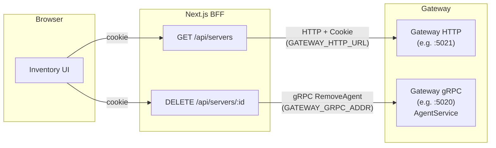
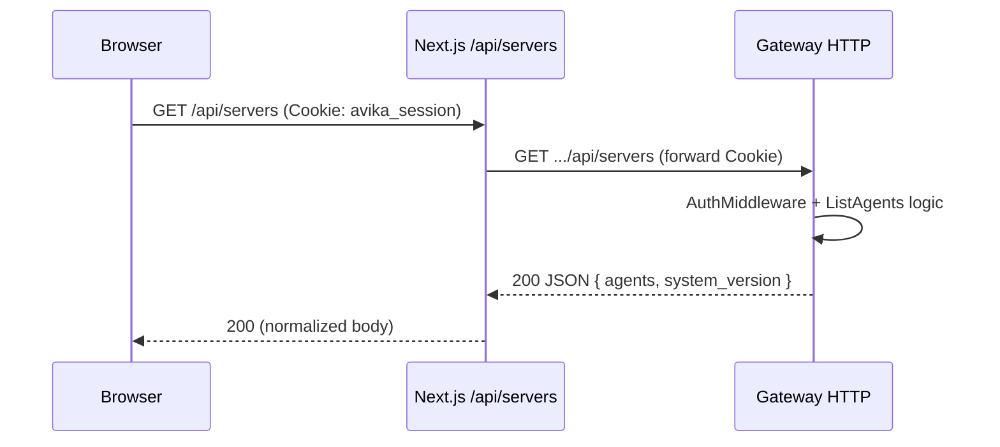
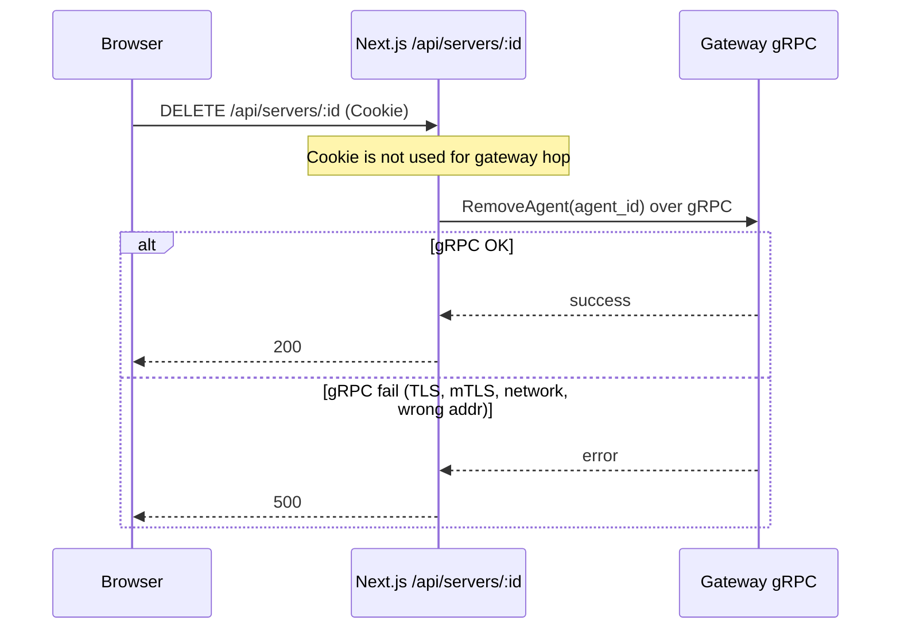
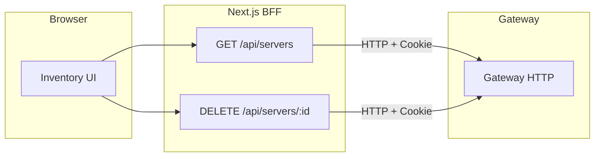
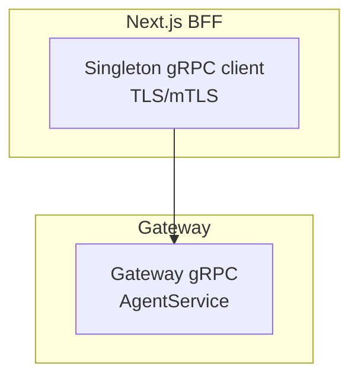

# Inventory BFF: HTTP vs gRPC transport asymmetry

This document explains why **listing agents** and **removing agents** can follow different paths from the browser through Next.js to the gateway, why that breaks in some deployments, and a **reliable, scalable** way to fix it.

For related TLS/PSK history and the move to HTTP-backed `GET /api/servers`, see [TLS_PSK_INVENTORY_RCA_AND_FIX_PLAN.md](./TLS_PSK_INVENTORY_RCA_AND_FIX_PLAN.md).

---

## 1. Actors and terms

| Actor | Role |
|--------|------|
| **Browser** | Runs the Avika UI; holds `avika_session` cookie after login. |
| **Next.js BFF** | Route handlers under `frontend/src/app/api/**`; server-side fetch and gRPC. |
| **Gateway HTTP** | REST-style API (e.g. port 5021), `AuthMiddleware`, session cookies. |
| **Gateway gRPC** | `AgentService` (e.g. port 5020), separate TLS/mTLS and networking from HTTP. |

---

## 2. Current architecture (asymmetric)

At a high level, the **browser only talks to Next.js**. Next.js then reaches the gateway in **two different ways** depending on the operation.

**Important:** Listing defaults to **HTTP proxy + session cookie**. Removal uses **gRPC only** from the Next server; there is **no** `DELETE /api/servers/{agentId}` on the gateway HTTP router today (assign/certificates have HTTP DELETE, agent row removal does not).

---

## 3. Sequence diagrams

### 3.1 List inventory (typical default)

Auth and transport align with most other **session-backed** dashboard calls.

### 3.2 Remove agent (today)

Failures here are **invisible** to the HTTP path that successfully listed agents: different port, different certs, different Service/Ingress, different firewall.

---

## 4. Why this is a reliability problem

| Concern | List (HTTP) | Delete (gRPC) |
|--------|-------------|----------------|
| **Auth** | Session cookie via `AuthMiddleware` | No cookie; relies on gRPC channel security / network trust |
| **Config surface** | `GATEWAY_HTTP_URL` (+ TLS at HTTP layer if any) | `GATEWAY_GRPC_ADDR`, `ENABLE_TLS`, CA, optional mTLS client cert |
| **Ops** | Standard L7 load balancing, health checks | gRPC-aware LB, or stable sidecar topology |
| **Failure mode** | User sees 401/502 from familiar path | User sees “list works, delete broken” |

So the asymmetry is not a theoretical nit: it is a **split blast radius** and **split configuration**.

---

## 5. Proposed solution: reliable and scalable

### 5.1 Recommended: **symmetric HTTP for session-scoped inventory CRUD**

**Goal:** Any operation the **logged-in user** performs on inventory that only needs gateway + DB + RBAC should use the **same transport and auth** as `GET /api/servers`.

**Implementation (done in repo)**

1. **Gateway:** `DELETE /api/servers/{agentId}` is registered in `cmd/gateway/main.go` with `AuthMiddleware`. `handleRemoveAgent` delegates to `RemoveAgent` (same path as gRPC).
2. **Next.js:** `frontend/src/app/api/servers/[id]/route.ts` proxies `DELETE` to `${GATEWAY_HTTP_URL}/api/servers/{id}` with `gatewayProxyCookieHeaders(request)` by default.
3. **Transport alignment:** if **`SERVERS_DELETE_USE_GRPC`** is unset, delete follows **`SERVERS_LIST_USE_GRPC`** (gRPC list ⇒ gRPC delete) so mixed wiring does not break removals. Set **`SERVERS_DELETE_USE_GRPC=false`** to force HTTP delete even when list uses gRPC; set **`true`** to force gRPC when list uses HTTP.
4. **Contract tests:** Add integration/E2E coverage when convenient (same auth cookie requirements as `GET /api/servers`).

**Why this scales**

- **Horizontal scaling:** Stateless Next replicas; gateway HTTP behind standard L7 LB; no per-request gRPC client churn for this path.
- **Operational simplicity:** One internal URL family, one TLS story, same cookies and RBAC as the rest of the UI API.
- **Reliability:** Eliminates “HTTP works, gRPC doesn’t” for inventory removal.

**What stays on gRPC**

Keep gRPC for **high-volume or streaming** features where it adds value (analytics streams, agent command paths, etc.), or where you already invest in a dedicated client stack. Inventory **delete** is a low-frequency, session-bound admin action; HTTP parity is the better default.

---

### 5.2 Alternative: **gRPC-only for both list and delete**

Point **both** `GET /api/servers` (when not using HTTP proxy) and `DELETE` at gRPC with **one** well-configured channel:

- Shared **connection pool / singleton client** in Next (already a single `getAgentServiceClient()`).
- Correct **TLS + mTLS** aligned with gateway.
- **Service identity** (mTLS cert) represents the BFF, not the end user; enforce **authorization inside** the gateway using metadata (e.g. forwarded session token) if you ever need user-scoped gRPC — today many setups trust the internal network only, which is weaker.

**When to choose this:** Strong preference for a single protobuf contract end-to-end and ops already standardize on gRPC from the BFF. **Cost:** You must keep gRPC connectivity and certs as reliable as HTTP for **every** UI feature that uses it.

---

### 5.3 Longer-term (optional): **API gateway or mesh**

For very large deployments, front both HTTP and gRPC through a **single edge** (API gateway or mesh) that terminates TLS once and applies consistent auth policy. That is an organizational scaling step, not required to fix the inventory asymmetry.

---

## 6. Decision summary

| Approach | Reliability | Ops complexity | Best for |
|----------|-------------|----------------|----------|
| **HTTP proxy for DELETE** (recommended) | High parity with list | Low (reuse HTTP stack) | Production UI, cookie auth, typical K8s ingress |
| **Fix gRPC only** | Good if gRPC is first-class everywhere | Medium–high (certs, LB, debugging) | Teams already all-in on BFF→gateway gRPC |
| **Dual path forever** | Poor (split failures) | Highest | Not recommended |

---

## 7. References in this repo

| Topic | Location |
|--------|----------|
| HTTP list proxy + cookie | `frontend/src/app/api/servers/route.ts` (`listAgentsViaHttp`) |
| Delete via gRPC | `frontend/src/app/api/servers/[id]/route.ts` (`DELETE`) |
| Cookie forwarding helper | `frontend/src/lib/gateway-proxy-headers.ts` |
| gRPC client TLS/mTLS | `frontend/src/lib/grpc-client.ts` |
| Gateway list HTTP route | `cmd/gateway/main.go` (`GET /api/servers` → `handleListAgents`) |
| Gateway delete HTTP route | `cmd/gateway/main.go` (`DELETE /api/servers/{agentId}` → `handleRemoveAgent`) |
| Remove agent implementation | `cmd/gateway/main.go` (`RemoveAgent`) |
| BFF delete proxy + gRPC rollback | `frontend/src/app/api/servers/[id]/route.ts` (`SERVERS_DELETE_USE_GRPC`) |

---

*Document version: 1.1 — asymmetry addressed with HTTP delete; gRPC rollback documented.*
